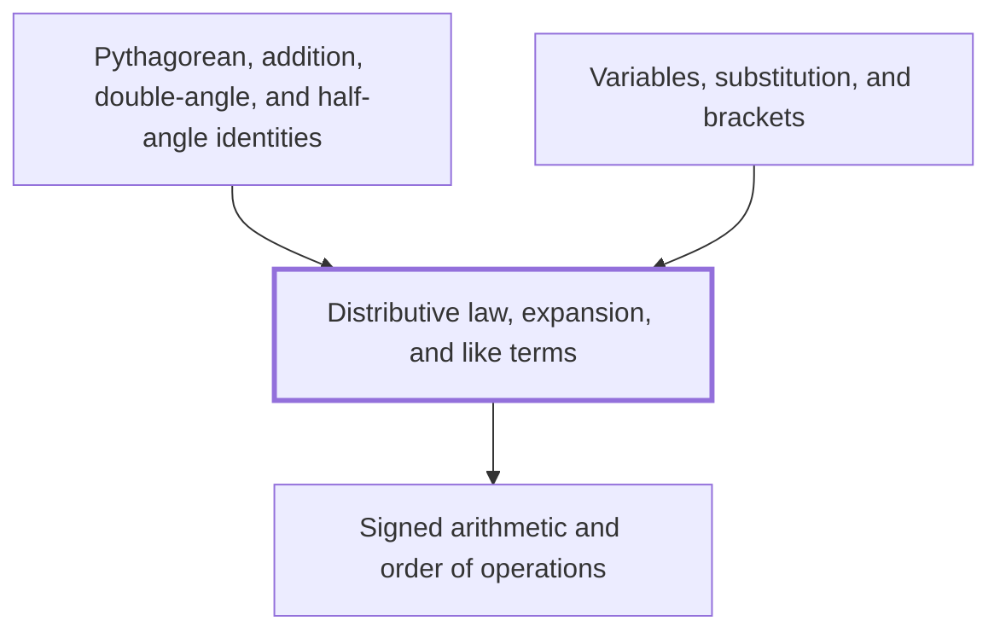

## In one sentence

The distributive law says that a number multiplying a bracket multiplies every term inside it, which lets you expand a bracket and then collect like terms.

## Why you need this

Expressions in algebra arrive with brackets in them, and most of what you do next needs the
brackets gone: comparing two expressions, substituting a value, or tidying an answer. The
distributive law is the rule that removes a bracket without changing the value. Collecting
like terms then shortens what is left. You use both every time you work with
[[Variables, substitution, and brackets]], and again when you prove the trigonometric
identities.

## The idea

Start with numbers. $3 \times (4 + 5)$ is $3 \times 9 = 27$, working the bracket first. You
get the same answer by multiplying each term inside the bracket by $3$ and adding:
$3 \times 4 + 3 \times 5 = 12 + 15 = 27$. That is the **distributive law**: the number
outside the bracket multiplies every term inside it.

$$a(b + c) = ab + ac$$

Writing the bracket out this way is called **expanding** it. The law holds for subtraction
too, because subtracting is adding the opposite: $2(7 - 3) = 2 \times 7 - 2 \times 3 = 8$.
Watch the signs with a negative number outside: $-2(x - 5) = -2x + 10$, because a negative
times a negative is positive.

**Like terms** are terms with exactly the same letters. $4x$ and $-x$ are like terms, and so
are $3$ and $7$; $4x$ and $4$ are not. You collect like terms by adding their numbers:
$4x - x + 3 + 7 = 3x + 10$.

Two brackets multiplied together expand the same way, one term at a time. Each term of the
first bracket multiplies the whole second bracket. In $(x + 3)(x + 2)$, the $x$ multiplies
$x + 2$ and the $3$ multiplies $x + 2$. Where a letter multiplies itself, use the index law
for multiplying powers, $x^m \times x^n = x^{m+n}$, so $x \times x = x^1 \times x^1 = x^2$.

## Worked example

Expand and collect $2(3x + 4) - 3(x - 1)$.

1. Expand the first bracket: $2 \times 3x + 2 \times 4 = 6x + 8$.
2. Expand the second, keeping the minus sign with the $3$: $-3 \times x + (-3) \times (-1) = -3x + 3$.
3. Put the two together: $6x + 8 - 3x + 3$.
4. Collect the $x$ terms, $6x - 3x = 3x$, and the numbers, $8 + 3 = 11$.

The answer is $3x + 11$. Check it with $x = 2$: the start gives $2(10) - 3(1) = 17$, and
$3 \times 2 + 11 = 17$.

Now two brackets: expand $(x + 3)(x + 2)$.

1. The $x$ multiplies the second bracket: $x \times x + x \times 2 = x^2 + 2x$.
2. The $3$ multiplies it: $3 \times x + 3 \times 2 = 3x + 6$.
3. Collect: $x^2 + 2x + 3x + 6 = x^2 + 5x + 6$.

Check with $x = 1$: $(4)(3) = 12$, and $1 + 5 + 6 = 12$.

## Common mistakes

- **Writing $2(x + 5) = 2x + 5$.** The $2$ multiplies only the first term. It multiplies
  every term: with $x = 1$, $2(1 + 5) = 12$, but $2 \times 1 + 5 = 7$. The expansion is
  $2x + 10$.
- **Writing $-3(x - 1) = -3x - 3$.** The sign of the second term is lost. $-3$ times $-1$ is
  $+3$, so the expansion is $-3x + 3$.
- **Collecting $4x + 3$ into $7x$.** $4x$ and $3$ are not like terms, because one has the
  letter $x$ and the other has no letter. $4x + 3$ is already as short as it gets.

## Builds on

<!-- generated:start builds-on -->
- [[Signed arithmetic and order of operations]] — Signed arithmetic and order of operations are the rules for adding, subtracting, multiplying and dividing positive and negative numbers, and for deciding which operation in a calculation you work out first, by BIDMAS.
<!-- generated:end builds-on -->

## Required by

<!-- generated:start required-by -->
- [[Pythagorean, addition, double-angle, and half-angle identities]]
- [[Variables, substitution, and brackets]]
<!-- generated:end required-by -->

<!-- generated:start mini-map -->

<!-- generated:end mini-map -->

## References
