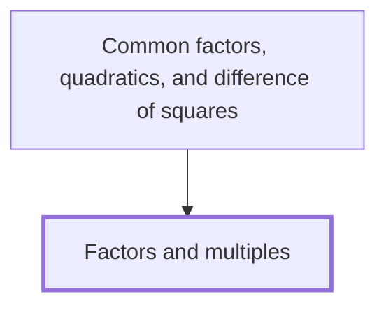

## In one sentence

A factor of a whole number divides it exactly, with nothing left over, and a multiple of a whole number is that number times another whole number.

## Why you need this

Factors and multiples are how you take a whole number apart and how you find numbers that
two others share. You use them to write a number as a product, to find the largest number
that goes into two numbers, and later to take a common factor out of an expression.

## The idea

In this Note, "number" means a whole number bigger than zero: $1$, $2$, $3$, and so on.

$12 = 3 \times 4$, so $3$ and $4$ are **factors** of $12$, and $12$ is a **multiple** of
$3$ and a multiple of $4$. A factor of a number divides it exactly: $12 \div 3 = 4$ with
nothing left over. $5$ is not a factor of $12$, because $12 \div 5$ is $2$ with $2$ left over.

Every number has $1$ and itself as factors, because $12 = 1 \times 12$. The factors of a
number come in pairs that multiply to give it. For $12$ the pairs are $1$ and $12$, $2$ and
$6$, $3$ and $4$, so the factors of $12$ are $1, 2, 3, 4, 6, 12$.

The multiples of $3$ are $3 \times 1, 3 \times 2, 3 \times 3, \ldots$, which is
$3, 6, 9, 12, \ldots$. They never stop, so you list the first few.

A **prime number** has exactly two factors: $1$ and itself. $2, 3, 5, 7, 11$ are prime. $1$
is not prime, because it has only one factor.

A **common factor** of two numbers is a factor of both. The **highest common factor** is
the largest of them. A **common multiple** of two numbers is a multiple of both, and the
**lowest common multiple** is the smallest of them.

## Worked example

Find the highest common factor and the lowest common multiple of $12$ and $18$.

1. The factors of $12$ are $1, 2, 3, 4, 6, 12$.
2. The factors of $18$ are $1, 2, 3, 6, 9, 18$, from the pairs $1 \times 18$, $2 \times 9$
   and $3 \times 6$.
3. The common factors are $1, 2, 3, 6$. The highest common factor is $6$.
4. The multiples of $12$ are $12, 24, 36, 48, \ldots$
5. The multiples of $18$ are $18, 36, 54, \ldots$
6. The first number in both lists is $36$. The lowest common multiple is $36$.

Check: $36 \div 12 = 3$ and $36 \div 18 = 2$, both with nothing left over.

## Common mistakes

- **Mixing up factors and multiples, and saying $24$ is a factor of $12$.** A factor of
  $12$ is never bigger than $12$, because it must divide $12$ exactly. $24$ is a multiple of
  $12$: $24 = 12 \times 2$.
- **Saying $1$ is prime.** A prime number has exactly two factors. $1$ has only one, so it is
  not prime.
- **Taking $12 \times 18 = 216$ as the lowest common multiple of $12$ and $18$.** $216$ is a
  common multiple, but not the lowest: $36$ is a multiple of both and is smaller.

## Builds on

<!-- generated:start builds-on -->
*Nothing: this is a Floor Node, knowledge the Module assumes.*
<!-- generated:end builds-on -->

## Required by

<!-- generated:start required-by -->
- [[Common factors, quadratics, and difference of squares]]
<!-- generated:end required-by -->

<!-- generated:start mini-map -->

<!-- generated:end mini-map -->

## References
