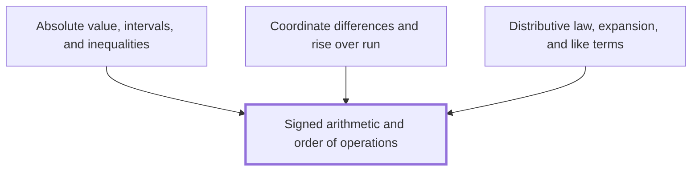
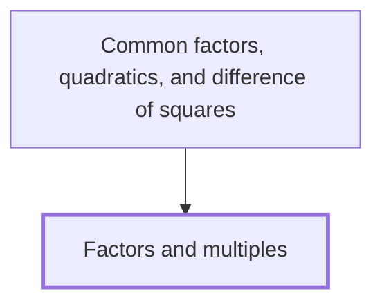

# Review Bundle: Signed arithmetic and order of operations

## Note

`wiki/algebra/Signed arithmetic and order of operations.md`, a algebra Note in Layer 0, as it stands:

````markdown
---
kind: concept
domain: algebra
requires: []
status: drafted
reviewed_by: none
created: 2026-10-02
updated: 2026-10-03
---

## In one sentence

Signed arithmetic and order of operations are the rules for adding, subtracting, multiplying and dividing positive and negative numbers, and for deciding which operation in a calculation you work out first, by BIDMAS.

## Why you need this

Almost every line of algebra and calculus asks you to evaluate an expression with negative numbers and several operations side by side. One wrong sign or one step in the wrong order makes every later line wrong.

Three later ideas lean on this directly. [[Absolute value, intervals, and inequalities]] measures how far a signed number is from $0$. [[Coordinate differences and rise over run]] subtracts one coordinate from another, where either can be negative, and divides one difference by another. [[Distributive law, expansion, and like terms]] multiplies a signed number into a bracket, one term at a time.

## The idea

**Signed numbers.** Every number other than $0$ has a *sign*: positive numbers lie to the right of $0$ on the number line and negative numbers to the left. The *opposite* of a number is the number the same distance from $0$ on the other side: the opposite of $5$ is $-5$, and the opposite of $-5$ is $5$. The number $0$ is its own opposite.

**Adding and subtracting.** Adding a positive number moves you right along the number line; adding a negative number moves you left. Subtracting a number is the same as adding its opposite:

$$7 - (-3) = 7 + 3 = 10, \qquad -2 - 5 = -2 + (-5) = -7.$$

So subtracting a negative number moves you right.

**Multiplying and dividing.** Work out the size of the answer as if both numbers were positive, then fix the sign:

- two numbers with the same sign give a positive answer: $(-4) \times (-3) = 12$;
- two numbers with different signs give a negative answer: $(-4) \times 3 = -12$ and $12 \div (-3) = -4$.

With a longer product, count the negative factors. An even number of them gives a positive answer, and an odd number gives a negative one.

**Order of operations.** When a calculation holds several operations, you work them in this order, called **BIDMAS**:

1. **B**rackets: work out what is inside each bracket first.
2. **I**ndices: powers such as $3^2$.
3. **D**ivision and **M**ultiplication, which share one rank.
4. **A**ddition and **S**ubtraction, which share one rank.

Within a shared rank you work from left to right. The letter order does not rank division above multiplication, or addition above subtraction: $8 - 3 + 2 = 5 + 2 = 7$, not $8 - 5 = 3$.

A minus sign in front of a number is applied after any index on that number. So $-3^2$ means the opposite of $3^2$, which is $-9$, while $(-3)^2 = (-3) \times (-3) = 9$. If you mean the negative number squared, write the bracket.

**Other names you may meet.** UK and Commonwealth schools and older texts say BODMAS, with *Orders* or *Of* for indices. US schools say PEMDAS, with *Parentheses* and *Exponents*, and Canadian schools say BEDMAS. All four describe the same rule, and every one of them has the same trap: its letter order seems to rank one operation of each pair above the other, and none does. Some physics and engineering texts, and some calculators, also read $1/2a$ as $\frac{1}{2a}$, while a strict left-to-right reading gives $\frac{1}{2}a$. This Wiki never writes $\div$ or $/$ in front of a product without a sign, so you always see $\frac{1}{2a}$ or $\frac{1}{2}a$, whichever is meant.

## Worked example

Evaluate $-2 \times (5 - 8)^2 + 12 \div (-4)$.

Brackets first. Inside the bracket, $5 - 8 = -3$:

$$-2 \times (-3)^2 + 12 \div (-4).$$

Indices next. The bracket holds the minus sign, so the whole of $-3$ is squared: $(-3)^2 = (-3) \times (-3) = 9$, positive because the two signs are the same:

$$-2 \times 9 + 12 \div (-4).$$

Multiplication and division, left to right. First $-2 \times 9 = -18$, negative because the signs differ. Then $12 \div (-4) = -3$, negative for the same reason:

$$-18 + (-3).$$

Addition last. Adding $-3$ moves you $3$ to the left of $-18$:

$$-18 + (-3) = -21.$$

Now the same pattern with a subtraction of a negative. Evaluate $10 - (-6) \div 2$. Division comes before subtraction, so $(-6) \div 2 = -3$ first. Then $10 - (-3) = 10 + 3 = 13$.

## Common mistakes

- **Writing $-3^2 = 9$.** The index applies to $3$ alone, before the minus sign, so $-3^2 = -(3 \times 3) = -9$. Only $(-3)^2$ is $9$.
- **Writing $8 - 3 + 2 = 3$**, by adding $3 + 2$ first because A comes before S in BIDMAS. Addition and subtraction share one rank and are worked left to right: $8 - 3 = 5$, then $5 + 2 = 7$.
- **Writing $12 \div 2 \times 3 = 2$**, by multiplying first. Division and multiplication share one rank, so you work left to right: $12 \div 2 = 6$, then $6 \times 3 = 18$.
- **Writing $7 - (-3) = 4$**, by treating the two minus signs as one subtraction of $3$. Subtracting $-3$ is adding its opposite, $3$: $7 - (-3) = 7 + 3 = 10$.
- **Thinking a negative times a negative is negative**, as in $(-4) \times (-3) = -12$. Two factors with the same sign give a positive product: $(-4) \times (-3) = 12$. Check it with a pattern: $(-4) \times 1 = -4$, $(-4) \times 0 = 0$, and each step down in the second factor adds $4$, so $(-4) \times (-1) = 4$.

## Builds on

<!-- generated:start builds-on -->
*Nothing: this is a Floor Node, knowledge the Module assumes.*
<!-- generated:end builds-on -->

## Required by

<!-- generated:start required-by -->
- [[Absolute value, intervals, and inequalities]]
- [[Coordinate differences and rise over run]]
- [[Distributive law, expansion, and like terms]] — The distributive law says that a number multiplying a bracket multiplies every term inside it, which lets you expand a bracket and then collect like terms.
<!-- generated:end required-by -->

<!-- generated:start mini-map -->

<!-- generated:end mini-map -->

## References
````

## Prerequisites

None: this is a Floor Node. It assumes only the Module's Floor, 8th-grade mathematics, and teaches the rest itself.

## Further below

Nothing: no prerequisite builds on another Node.

## Not taught before it

Every Node of the Module above the Floor. None is taught before this Note, so the Note may not use the idea any of them teaches, except to point to it as a marked Cross-reference. The other Floor Nodes are not listed: like this one, each is 8th-grade knowledge the Module assumes, so this Note may use their ideas.

- Absolute value, intervals, and inequalities
- Algebra
- Algebraic fractions and rationalisation
- Angles, circumference, and arc length
- Approaching a value
- Average rate of change
- Calculating limits
- Closeness and distance
- Common factors, quadratics, and difference of squares
- Comparing the limit with the function value
- Continuity
- Coordinate differences and rise over run
- Derivative
- Difference quotient
- Distributive law, expansion, and like terms
- Equations and rearranging formulas
- Expressions and operations
- Factorisation
- Function notation, domain, and range
- Functions, slopes, and rates
- Geometry and angle measurement
- Index laws and fractional powers
- Left-hand and right-hand limits
- Limit laws and substitution
- Limit of (cos h - 1) over h as h approaches zero
- Limit of sin h over h as h approaches zero
- Limits
- Linear, quadratic, polynomial, and rational functions
- Measuring change
- Numerical tables and graph behaviour
- Period, amplitude, phase shifts, and symmetry
- Piecewise functions, holes, and jumps
- Powers and radicals
- Pythagorean, addition, double-angle, and half-angle identities
- Quadrants, signs, and reference angles
- Ratios, proportion, units, and average speed
- Right-triangle trigonometry
- Similar triangles and Pythagoras' theorem
- Simplification and equations
- Simplifying before taking a limit
- Sine, cosine, and tangent ratios
- Slope of a straight line
- Special-angle values
- Translations, reflections, and stretches
- Trigonometric functions
- Trigonometric graphs
- Trigonometric identities
- Trigonometric limits
- Trigonometry
- Understanding functions
- Unit circle and radians
- Variables, substitution, and brackets

## Layer siblings

The other Notes in Layer 0, written alongside this one by authors who could not see each other. Each written one, whole:

`wiki/algebra/Factors and multiples.md`:

````markdown
---
kind: concept
domain: algebra
requires: []
status: drafted
reviewed_by: none
created: 2026-10-02
updated: 2026-10-03
---

## In one sentence

A factor of a whole number divides it exactly, with nothing left over, and a multiple of a whole number is that number times another whole number.

## Why you need this

Factors and multiples are how you take a whole number apart and how you find numbers that
two others share. You use them to write a number as a product, to find the largest number
that goes into two numbers, and later to take a common factor out of an expression.

## The idea

In this Note, "number" means a whole number bigger than zero: $1$, $2$, $3$, and so on.

$12 = 3 \times 4$, so $3$ and $4$ are **factors** of $12$, and $12$ is a **multiple** of
$3$ and a multiple of $4$. A factor of a number divides it exactly: $12 \div 3 = 4$ with
nothing left over. $5$ is not a factor of $12$, because $12 \div 5$ is $2$ with $2$ left over.

Every number has $1$ and itself as factors, because $12 = 1 \times 12$. The factors of a
number come in pairs that multiply to give it. For $12$ the pairs are $1$ and $12$, $2$ and
$6$, $3$ and $4$, so the factors of $12$ are $1, 2, 3, 4, 6, 12$.

The multiples of $3$ are $3 \times 1, 3 \times 2, 3 \times 3, \ldots$, which is
$3, 6, 9, 12, \ldots$. They never stop, so you list the first few.

A **prime number** has exactly two factors: $1$ and itself. $2, 3, 5, 7, 11$ are prime. $1$
is not prime, because it has only one factor.

A **common factor** of two numbers is a factor of both. The **highest common factor** is
the largest of them. A **common multiple** of two numbers is a multiple of both, and the
**lowest common multiple** is the smallest of them.

## Worked example

Find the highest common factor and the lowest common multiple of $12$ and $18$.

1. The factors of $12$ are $1, 2, 3, 4, 6, 12$.
2. The factors of $18$ are $1, 2, 3, 6, 9, 18$, from the pairs $1 \times 18$, $2 \times 9$
   and $3 \times 6$.
3. The common factors are $1, 2, 3, 6$. The highest common factor is $6$.
4. The multiples of $12$ are $12, 24, 36, 48, \ldots$
5. The multiples of $18$ are $18, 36, 54, \ldots$
6. The first number in both lists is $36$. The lowest common multiple is $36$.

Check: $36 \div 12 = 3$ and $36 \div 18 = 2$, both with nothing left over.

## Common mistakes

- **Mixing up factors and multiples, and saying $24$ is a factor of $12$.** A factor of
  $12$ is never bigger than $12$, because it must divide $12$ exactly. $24$ is a multiple of
  $12$: $24 = 12 \times 2$.
- **Saying $1$ is prime.** A prime number has exactly two factors. $1$ has only one, so it is
  not prime.
- **Taking $12 \times 18 = 216$ as the lowest common multiple of $12$ and $18$.** $216$ is a
  common multiple, but not the lowest: $36$ is a multiple of both and is smaller.

## Builds on

<!-- generated:start builds-on -->
*Nothing: this is a Floor Node, knowledge the Module assumes.*
<!-- generated:end builds-on -->

## Required by

<!-- generated:start required-by -->
- [[Common factors, quadratics, and difference of squares]]
<!-- generated:end required-by -->

<!-- generated:start mini-map -->

<!-- generated:end mini-map -->

## References
````

Not yet written: **Coordinates, tables, and plotting**, **Decimals, ordering, and number lines**, **Division restrictions**, **Equivalent fractions and cancellation**, **Inputs, outputs, and composition**, **Inverse operations**, **Multiplication, division, squares, and roots**.

## Notation authority

`wiki/Conventions.md`, whole:

````markdown
---
kind: reference
domain: wiki
requires: []
status: drafted
reviewed_by: none
created: 2026-10-02
updated: 2026-10-03
aliases:
  - Notation
tags:
  - conventions
---

## In one sentence

Which symbol and which word this Wiki uses for each idea, and how other sources write it
when they disagree.

## How to use this

Look up the symbol or term you are about to write. **This Wiki** is what you write. Each
**Elsewhere** line is a convention a learner will meet in another source, then who uses it.
Where it would trip a learner up, say so once, in the Note that introduces the idea. Never
resolve a disagreement silently by writing the other form. Spelling is British English
throughout: *factorise*, *centre*, *recognise*.

Every entry has the same shape: the symbol or term as its heading, one **This Wiki** line,
and an **Elsewhere** line for each conflicting convention, attributed after a dash — or a
single "**Elsewhere:** none known". A **Same** line names a source that writes it this Wiki's
way. Each line attributes one source, so two sources that disagree are two lines, never one.
Mathematics is KaTeX: `check` rejects anything else.

## Entries

### Order of operations

- **This Wiki:** brackets, then indices, then multiplication and division, then addition and subtraction — called **BIDMAS**, as UK schools teach it. Multiplication and division share one rank and are worked left to right; so are addition and subtraction: $8 - 3 + 2 = 7$, not $3$.
- **Elsewhere:** BODMAS (*Orders* or *Of* for indices) — UK and Commonwealth schools, older texts.
- **Elsewhere:** PEMDAS (*Parentheses, Exponents*) — US schools. BEDMAS — Canadian schools. Same rule. Every mnemonic's letter order wrongly suggests a ranking within each pair: division before multiplication in BIDMAS, BODMAS and BEDMAS, the reverse in PEMDAS, and addition before subtraction in all four.

### Implied multiplication after division

- **This Wiki:** never write $\div$ or $/$ before a product written without a sign. Write $\frac{1}{2a}$ or $\frac{1}{2}a$, whichever is meant.
- **Elsewhere:** $1/2a$ read as $\frac{1}{2a}$, binding $2a$ first — many physics and engineering texts, and some calculators. A strict left-to-right reading of BIDMAS gives $\frac{1}{2}a$, so $6 \div 2(1 + 2)$ has no agreed value.

### Brackets

- **This Wiki:** *brackets* are $( \, )$, *square brackets* $[ \, ]$, *braces* $\{ \, \}$.
- **Elsewhere:** *parentheses* for $( \, )$ and *brackets* for $[ \, ]$ — US texts.

### Index and power

- **This Wiki:** in $2^3$ the $3$ is the *index* (plural *indices*), and $2^3$ is a *power* of $2$: "two to the power three". The laws are the *index laws*.
- **Elsewhere:** *exponent* for the index — US texts, and most university texts everywhere.

### Multiplication sign

- **This Wiki:** $\times$ between numbers, $3 \times 4$; no sign between letters or a number and a letter, $3ab$. Never $*$, and never $\cdot$ between numbers.
- **Same:** no sign between a number and a letter, $\sin 2x$ — [[OpenStax Calculus Volume 1, section 2.2]].
- **Elsewhere:** a centred dot between numbers, $3 \cdot 4$ — US texts and much of continental Europe. Older British printing raises the decimal point to the centre, $2{\cdot}5$, so there the centred dot is not multiplication.

### Decimal point and digit groups

- **This Wiki:** a decimal point, $2.5$. Digits of a long number are grouped in threes with a thin space, $12\,345.678$.
- **Same:** a decimal point, $0.25$ — [[OpenStax Calculus Volume 1, section 2.2]].
- **Elsewhere:** a decimal comma, $2{,}5$ — much of continental Europe and South America.
- **Elsewhere:** a comma between groups, $12{,}345$ — UK and US everyday print. It reads as a decimal comma to a European reader, which is why this Wiki uses a space (the SI recommendation).
- **Elsewhere:** a comma between groups, $10{,}000$ — [[OpenStax Calculus Volume 1, section 2.2]].

### Slope

- **This Wiki:** *slope*, as the Node is named in the Anchor Graph: [[Slope of a straight line]]. Introduce *gradient* once, there, as the same thing.
- **Same:** *slope* — [[OpenStax Calculus Volume 1, section 2.2]].
- **Elsewhere:** *gradient* — UK schools and examinations. University texts reserve *gradient* for a vector, $\nabla f$, which is another reason to keep it out of this Module.

### Intervals

- **This Wiki:** $(a, b)$ excludes both ends, $[a, b]$ includes both, $[a, b)$ includes only $a$.
- **Same:** $(a, c)$ for an open interval — [[OpenStax Calculus Volume 1, section 2.2]].
- **Elsewhere:** reversed square brackets for an excluded end, $]a, b[$ and $[a, b[$ — France and parts of continental Europe. The same $(a, b)$ also names the point with coordinates $a$ and $b$; say which.

### Inverse trigonometric functions

- **This Wiki:** $\arcsin x$, $\arccos x$, $\arctan x$. A power of a trigonometric function is $\sin^2 x$, meaning $(\sin x)^2$.
- **Elsewhere:** $\sin^{-1} x$ for $\arcsin x$ — UK and US school texts and calculator keys. It is not $(\sin x)^{-1}$, though $\sin^2 x$ is $(\sin x)^2$: the reason this Wiki avoids it.

### Tangent

- **This Wiki:** $\tan x$, and $\cot x$ for its reciprocal.
- **Elsewhere:** $\operatorname{tg} x$ and $\operatorname{ctg} x$ — Russian and much of Central and Eastern European school mathematics.

### Function notation

- **This Wiki:** $f(x)$ is the output of the function $f$ at the input $x$, and its graph is $y = f(x)$. These brackets are not multiplication.
- **Same:** $f(x)$, and $y = f(x)$ for the graph — [[OpenStax Calculus Volume 1, section 2.2]].
- **Elsewhere:** $f : x \mapsto 2x + 1$ for the rule itself — UK A-level texts.

### Piecewise definitions

- **This Wiki:** one brace, each piece's rule then *if* and its condition: $f(x) = \begin{cases} x + 1 & \text{if } x < 2 \\ x^2 - 4 & \text{if } x \geq 2 \end{cases}$
- **Same:** a brace, with *if* before each condition — [[OpenStax Calculus Volume 1, section 2.2]].
- **Elsewhere:** a comma or *for* in place of *if* — many university texts. Same meaning.

### Limit

- **This Wiki:** $\lim_{x \to a} f(x) = L$, read "the limit of $f(x)$ as $x$ approaches $a$ is $L$". On the way, $x$ is never equal to $a$.
- **Same:** $\lim_{x \to a} f(x) = L$ — [[OpenStax Calculus Volume 1, section 2.2]].
- **Elsewhere:** $f(x) \to L$ as $x \to a$ — university analysis texts. Same meaning, no $\lim$.

### One-sided limits

- **This Wiki:** $\lim_{x \to a^-} f(x)$ is the limit *from the left*, through $x < a$, and $\lim_{x \to a^+} f(x)$ the limit *from the right*, through $x > a$. The Node is [[Left-hand and right-hand limits]].
- **Same:** $x \to a^-$ and $x \to a^+$, "from the left" and "from the right" — [[OpenStax Calculus Volume 1, section 2.2]].
- **Elsewhere:** $x \uparrow a$ and $x \downarrow a$ — some university analysis texts.
- **Elsewhere:** $x \to a - 0$ and $x \to a + 0$ — Russian and much of Central and Eastern European mathematics.

### A limit that does not exist

- **This Wiki:** say so in words, "the limit does not exist", and say how it fails: the two sides disagree, the values never settle, or they grow without bound. For the last, write $\lim_{x \to a} f(x) = \infty$ or $-\infty$, and still say no limit exists: $\infty$ is not a number.
- **Elsewhere:** DNE written after the limit, $\lim_{x \to 0} \sin(1/x)$ DNE — [[OpenStax Calculus Volume 1, section 2.2]].
- **Elsewhere:** $+\infty$ with its sign always written, and an infinite limit never written DNE — [[OpenStax Calculus Volume 1, section 2.2]].
````

## Sources

No sources apply. This is a Floor Node: its claims are 8th-grade knowledge the Module assumes, and need no citation.
