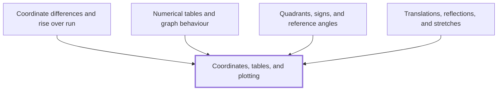

## In one sentence

A point on the plane is named by a pair of coordinates $(x, y)$, and a table of values is a list of such pairs that you can plot one point at a time.

## Why you need this

Every graph in this Module is a picture of a table: a set of inputs, each paired with the output it gives. Before you can read a graph, or draw one, you need to be able to go from a pair of numbers to a point and back again without hesitating.

## The idea

The plane has two number lines crossing at right angles. The horizontal one is the $x$-axis and the vertical one is the $y$-axis. They cross at the origin, the point $(0, 0)$.

The point $(3, 2)$ is found by starting at the origin, moving $3$ to the right along the $x$-axis, then $2$ up, parallel to the $y$-axis. The first number always says how far across, and the second how far up. A negative first number moves you left, and a negative second number moves you down, so $(-1, -4)$ is $1$ to the left and $4$ down.

A table of values pairs each input $x$ with an output $y$. Each row of the table is one point. Plot every row and you see the shape of the relationship.

## Worked example

Take the rule $y = x^2$, and work out $y$ for each whole number $x$ from $-2$ to $2$:

| $x$ | $-2$ | $-1$ | $0$ | $1$ | $2$ |
|---|---|---|---|---|---|
| $y$ | $4$ | $1$ | $0$ | $1$ | $4$ |

The rows give the points $(-2, 4)$, $(-1, 1)$, $(0, 0)$, $(1, 1)$ and $(2, 4)$. Plot them one by one. They are not in a straight line: they fall to the origin and rise again on the other side, and the two halves are mirror images, because $(-2)^2$ and $2^2$ are both $4$. Joined in order of $x$, they trace a U-shaped curve.

## Common mistakes

**"I plotted $(1, 3)$ by going up 1 and across 3."** The order is fixed: across first, then up. $(1, 3)$ and $(3, 1)$ are different points, and swapping the numbers puts the point in the wrong place every time the two differ.

**"$(-2, 4)$ and $(2, 4)$ are the same point, since both have $y = 4$."** They share a height but not a position. One is $2$ to the left of the $y$-axis and the other $2$ to the right.

## Builds on

<!-- generated:start builds-on -->
*Nothing: this is a Floor Node, knowledge the Module assumes.*
<!-- generated:end builds-on -->

## Required by

<!-- generated:start required-by -->
- [[Coordinate differences and rise over run]]
- [[Numerical tables and graph behaviour]]
- [[Quadrants, signs, and reference angles]]
- [[Translations, reflections, and stretches]]
<!-- generated:end required-by -->

<!-- generated:start mini-map -->

<!-- generated:end mini-map -->

## References
