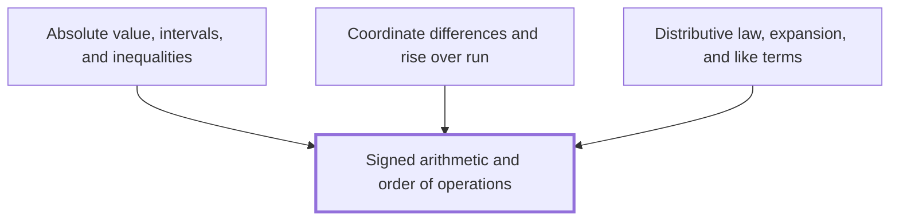

## In one sentence

Signed arithmetic and order of operations are the rules for adding, subtracting, multiplying and dividing positive and negative numbers, and for deciding which operation in a calculation you work out first, by BIDMAS.

## Why you need this

Almost every line of algebra and calculus asks you to evaluate an expression with negative numbers and several operations side by side. One wrong sign or one step in the wrong order makes every later line wrong.

Three later ideas lean on this directly. [[Absolute value, intervals, and inequalities]] measures how far a signed number is from $0$. [[Coordinate differences and rise over run]] subtracts one coordinate from another, where either can be negative, and divides one difference by another. [[Distributive law, expansion, and like terms]] multiplies a signed number into a bracket, one term at a time.

## The idea

**Signed numbers.** Every number other than $0$ has a *sign*: positive numbers lie to the right of $0$ on the number line and negative numbers to the left. The *opposite* of a number is the number the same distance from $0$ on the other side: the opposite of $5$ is $-5$, and the opposite of $-5$ is $5$. The number $0$ is its own opposite.

**Adding and subtracting.** Adding a positive number moves you right along the number line; adding a negative number moves you left. Subtracting a number is the same as adding its opposite:

$$7 - (-3) = 7 + 3 = 10, \qquad -2 - 5 = -2 + (-5) = -7.$$

So subtracting a negative number moves you right.

**Multiplying and dividing.** Work out the size of the answer as if both numbers were positive, then fix the sign:

- two numbers with the same sign give a positive answer: $(-4) \times (-3) = 12$;
- two numbers with different signs give a negative answer: $(-4) \times 3 = -12$ and $12 \div (-3) = -4$.

With a longer product, count the negative factors. An even number of them gives a positive answer, and an odd number gives a negative one.

**Order of operations.** When a calculation holds several operations, you work them in this order, called **BIDMAS**:

1. **B**rackets: work out what is inside each bracket first.
2. **I**ndices: powers such as $3^2$.
3. **D**ivision and **M**ultiplication, which share one rank.
4. **A**ddition and **S**ubtraction, which share one rank.

Within a shared rank you work from left to right. The letter order does not rank division above multiplication, or addition above subtraction: $8 - 3 + 2 = 5 + 2 = 7$, not $8 - 5 = 3$.

A minus sign in front of a number is applied after any index on that number. So $-3^2$ means the opposite of $3^2$, which is $-9$, while $(-3)^2 = (-3) \times (-3) = 9$. If you mean the negative number squared, write the bracket.

**Other names you may meet.** UK and Commonwealth schools and older texts say BODMAS, with *Orders* or *Of* for indices. US schools say PEMDAS, with *Parentheses* and *Exponents*, and Canadian schools say BEDMAS. All four describe the same rule, and every one of them has the same trap: its letter order seems to rank one operation of each pair above the other, and none does. Some physics and engineering texts, and some calculators, also read $1/2a$ as $\frac{1}{2a}$, while a strict left-to-right reading gives $\frac{1}{2}a$. This Wiki never writes $\div$ or $/$ in front of a product without a sign, so you always see $\frac{1}{2a}$ or $\frac{1}{2}a$, whichever is meant.

## Worked example

Evaluate $-2 \times (5 - 8)^2 + 12 \div (-4)$.

Brackets first. Inside the bracket, $5 - 8 = -3$:

$$-2 \times (-3)^2 + 12 \div (-4).$$

Indices next. The bracket holds the minus sign, so the whole of $-3$ is squared: $(-3)^2 = (-3) \times (-3) = 9$, positive because the two signs are the same:

$$-2 \times 9 + 12 \div (-4).$$

Multiplication and division, left to right. First $-2 \times 9 = -18$, negative because the signs differ. Then $12 \div (-4) = -3$, negative for the same reason:

$$-18 + (-3).$$

Addition last. Adding $-3$ moves you $3$ to the left of $-18$:

$$-18 + (-3) = -21.$$

Now the same pattern with a subtraction of a negative. Evaluate $10 - (-6) \div 2$. Division comes before subtraction, so $(-6) \div 2 = -3$ first. Then $10 - (-3) = 10 + 3 = 13$.

## Common mistakes

- **Writing $-3^2 = 9$.** The index applies to $3$ alone, before the minus sign, so $-3^2 = -(3 \times 3) = -9$. Only $(-3)^2$ is $9$.
- **Writing $8 - 3 + 2 = 3$**, by adding $3 + 2$ first because A comes before S in BIDMAS. Addition and subtraction share one rank and are worked left to right: $8 - 3 = 5$, then $5 + 2 = 7$.
- **Writing $12 \div 2 \times 3 = 2$**, by multiplying first. Division and multiplication share one rank, so you work left to right: $12 \div 2 = 6$, then $6 \times 3 = 18$.
- **Writing $7 - (-3) = 4$**, by treating the two minus signs as one subtraction of $3$. Subtracting $-3$ is adding its opposite, $3$: $7 - (-3) = 7 + 3 = 10$.
- **Thinking a negative times a negative is negative**, as in $(-4) \times (-3) = -12$. Two factors with the same sign give a positive product: $(-4) \times (-3) = 12$. Check it with a pattern: $(-4) \times 1 = -4$, $(-4) \times 0 = 0$, and each step down in the second factor adds $4$, so $(-4) \times (-1) = 4$.

## Builds on

<!-- generated:start builds-on -->
*Nothing: this is a Floor Node, knowledge the Module assumes.*
<!-- generated:end builds-on -->

## Required by

<!-- generated:start required-by -->
- [[Absolute value, intervals, and inequalities]]
- [[Coordinate differences and rise over run]]
- [[Distributive law, expansion, and like terms]]
<!-- generated:end required-by -->

<!-- generated:start mini-map -->

<!-- generated:end mini-map -->

## References
