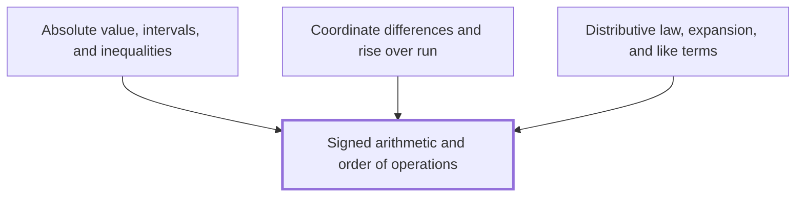

# Context Pack: Signed arithmetic and order of operations

## Node

- **Name:** Signed arithmetic and order of operations
- **Domain:** algebra

## Skeleton

The Note you write is `wiki/algebra/Signed arithmetic and order of operations.md`. As it stands:

````markdown
---
kind: concept
domain: algebra
requires: []
status: stub
reviewed_by: none
created: 2026-10-02
updated: 2026-10-02
---

## In one sentence

## Why you need this

## The idea

## Worked example

## Common mistakes

## Builds on

<!-- generated:start builds-on -->
*Nothing: this is a Floor Node, knowledge the Module assumes.*
<!-- generated:end builds-on -->

## Required by

<!-- generated:start required-by -->
- [[Absolute value, intervals, and inequalities]]
- [[Coordinate differences and rise over run]]
- [[Distributive law, expansion, and like terms]]
<!-- generated:end required-by -->

<!-- generated:start mini-map -->

<!-- generated:end mini-map -->

## References
````

## Builds on

Nothing: this is a Floor Node, knowledge the Module assumes.

## Required by

- **Absolute value, intervals, and inequalities** — *no one-sentence summary written yet*
- **Coordinate differences and rise over run** — *no one-sentence summary written yet*
- **Distributive law, expansion, and like terms** — *no one-sentence summary written yet*

## Archetype catalogue

- `function-plot` — Plots up to four functions on shared axes, with an optional point you drag along a curve to read its output.
- `secant-to-tangent` — Draws the secant through two points on a curve and slides the second point in until the secant becomes the tangent.
- `unit-circle` — A point you drag round the unit circle, showing its angle in degrees and radians and its coordinates as cosine and sine.
- `right-triangle` — A right-angled triangle you reshape by angle and size, labelling its sides by role or length and showing their ratios.
- `limit-table` — Tabulates a function's outputs as the input closes in on a value from either side, alongside the function's graph.
- `number-line` — A number line marking points, intervals and distances, with a band you widen or narrow around a centre.
- `transformation-explorer` — Sliders that shift, stretch and reflect a base function, leaving its original graph faintly behind for comparison.
- `slope-triangle` — Two points you drag on a grid, joined by a line, with the rise and run between them drawn and their ratio as the slope.
- `piecewise-explorer` — Draws a function defined in pieces, marking holes and jumps, and compares each side's limit with the value at a point.
- `expression-stepper` — Steps through an algebraic working one line at a time, each line giving the reason it follows from the line before.
- `ratio-scaler` — Two linked quantities scaled together by one slider, so their ratio stays fixed while both amounts change.
- `grid-plotter` — A coordinate grid where you plot points from a table or read their coordinates off, each point labelled as you place it.
- `squeeze-visual` — Shows why sin h / h tends to 1 and (cos h - 1) / h tends to 0, trapping each quotient between bounds as h shrinks.

## House style

````markdown
# House style

These rules make every Note in the Wiki sound like one writer wrote it. They apply to the
prose a writer adds to a Note: `## In one sentence`, `## Why you need this`, `## The idea`,
`## Worked example` and `## Common mistakes`, plus the `caption` of an Interactive. They do
not cover generated blocks, which no writer touches. Each rule says what to write and how to
tell whether you have.

## Spelling: British English

Use British spelling and the words British schools use: *factorise*, *recognise*, *centre*,
*behaviour*, *modelling*, *maths*. Where a word has an *-ise* and an *-ize* form, write
*-ise*. Mathematical terms follow the notation authority (below), which settles words such as
*brackets* and *index*.

## Voice: second person, present tense

Speak to the learner as *you*, and describe the mathematics as happening now. Write "You can
factorise this", not "One may factorise this", "We factorise this" or "This was factorised".
Steps are instructions or present-tense statements: "Subtract 3 from both sides", "The
bracket expands to $2x + 6$".

## Order: define before use

Every term and symbol is defined at or before its first use. A term counts as defined when
one of these holds:

- the Note defines it earlier in its own prose;
- it is the subject of a prerequisite, a Note the Note builds on;
- it is 8th-grade arithmetic, the Floor the Module assumes.

Anything else is a forward reference. The one allowed form is a marked Cross-reference: a
wikilink to the other Note, in a sentence that tells the reader it is an aside they can skip,
such as "You meet this again in [[Limits]]." The Note's own explanation never depends on it.

## Banned words

*simply*, *just*, *obviously*, *clearly*, *trivially*, and their adjectives (*simple*,
*obvious*, *clear*, *trivial*) whenever they say how easy a step is. To a learner who is
stuck, each one says the step is easy and the trouble is theirs, and it carries no
information. Delete the word. If the sentence then feels thin, the step needs explaining:
show the working instead. The words stay allowed where they say nothing about difficulty:
*simplest form*, *clear the fractions*, *just under 2*.

## Worked example: numbers first

Every worked example works through specific numbers before it states anything general. The
first lines of `## Worked example` use numbers such as $3$, $-2$ or $\frac{1}{4}$, with every
step shown. A general form in letters, if the Note gives one, comes after, and is read off
the worked numbers. A worked example that opens with letters breaks this rule.

## Common mistakes: the mistake, then why

`## Common mistakes` lists mistakes learners actually make. Each entry has two parts:

1. **The mistake, as the learner makes it**: the wrong working or the wrong belief, in their
   terms. "Writing $(a + b)^2 = a^2 + b^2$", or "Thinking a negative times a negative is
   negative".
2. **Why it is wrong**: a counterexample with numbers, or the reason the step fails, and the
   correct version.

The section is not a list of rules ("Always remember to…", "Never…"), tips, or warnings with
no wrong working attached. If you cannot write down the wrong working, it is not an entry.

## Notation: follow the notation authority

`wiki/Conventions.md` decides which symbol and which word you write. Look up every symbol
and term there before writing it, and write its **This Wiki** form. Where its **Elsewhere**
lines say another convention would trip a learner up, the Note that introduces the idea says
so once, attributing each convention to who uses it. Wherever two sources disagree on a
convention, both claims appear with their sources, and the Note does not pick one silently.
If the Note needs a symbol or term the notation authority does not cover, write the form
British school texts use and report the gap when you hand the Note back, so an entry can be
added.

## Length

`## In one sentence` is exactly one sentence. It is copied into other Notes and briefings
on its own, so it names its subject rather than saying "this Note".

A Note that is not a Floor Note runs to 400–900 words of prose across the five sections this
file covers. A Floor Note, one that requires nothing, may be shorter, and keeps to the 900
ceiling. Count words of prose only: leave out display mathematics, `interactive` blocks and
generated blocks. Under 400 words, the Note has left something unexplained. Over 900, it is
teaching more than its one idea: cut back to it.
````

## Notation authority

`wiki/Conventions.md`, whole:

````markdown
---
kind: reference
domain: wiki
requires: []
status: drafted
reviewed_by: none
created: 2026-10-02
updated: 2026-10-03
aliases:
  - Notation
tags:
  - conventions
---

## In one sentence

Which symbol and which word this Wiki uses for each idea, and how other sources write it
when they disagree.

## How to use this

Look up the symbol or term you are about to write. **This Wiki** is what you write. Each
**Elsewhere** line is a convention a learner will meet in another source, then who uses it.
Where it would trip a learner up, say so once, in the Note that introduces the idea. Never
resolve a disagreement silently by writing the other form. Spelling is British English
throughout: *factorise*, *centre*, *recognise*.

Every entry has the same shape: the symbol or term as its heading, one **This Wiki** line,
and an **Elsewhere** line for each conflicting convention, attributed after a dash — or a
single "**Elsewhere:** none known". A **Same** line names a source that writes it this Wiki's
way. Each line attributes one source, so two sources that disagree are two lines, never one.
Mathematics is KaTeX: `check` rejects anything else.

## Entries

### Order of operations

- **This Wiki:** brackets, then indices, then multiplication and division, then addition and subtraction — called **BIDMAS**, as UK schools teach it. Multiplication and division share one rank and are worked left to right; so are addition and subtraction: $8 - 3 + 2 = 7$, not $3$.
- **Elsewhere:** BODMAS (*Orders* or *Of* for indices) — UK and Commonwealth schools, older texts.
- **Elsewhere:** PEMDAS (*Parentheses, Exponents*) — US schools. BEDMAS — Canadian schools. Same rule. Every mnemonic's letter order wrongly suggests a ranking within each pair: division before multiplication in BIDMAS, BODMAS and BEDMAS, the reverse in PEMDAS, and addition before subtraction in all four.

### Implied multiplication after division

- **This Wiki:** never write $\div$ or $/$ before a product written without a sign. Write $\frac{1}{2a}$ or $\frac{1}{2}a$, whichever is meant.
- **Elsewhere:** $1/2a$ read as $\frac{1}{2a}$, binding $2a$ first — many physics and engineering texts, and some calculators. A strict left-to-right reading of BIDMAS gives $\frac{1}{2}a$, so $6 \div 2(1 + 2)$ has no agreed value.

### Brackets

- **This Wiki:** *brackets* are $( \, )$, *square brackets* $[ \, ]$, *braces* $\{ \, \}$.
- **Elsewhere:** *parentheses* for $( \, )$ and *brackets* for $[ \, ]$ — US texts.

### Index and power

- **This Wiki:** in $2^3$ the $3$ is the *index* (plural *indices*), and $2^3$ is a *power* of $2$: "two to the power three". The laws are the *index laws*.
- **Elsewhere:** *exponent* for the index — US texts, and most university texts everywhere.

### Multiplication sign

- **This Wiki:** $\times$ between numbers, $3 \times 4$; no sign between letters or a number and a letter, $3ab$. Never $*$, and never $\cdot$ between numbers.
- **Same:** no sign between a number and a letter, $\sin 2x$ — [[OpenStax Calculus Volume 1, section 2.2]].
- **Elsewhere:** a centred dot between numbers, $3 \cdot 4$ — US texts and much of continental Europe. Older British printing raises the decimal point to the centre, $2{\cdot}5$, so there the centred dot is not multiplication.

### Decimal point and digit groups

- **This Wiki:** a decimal point, $2.5$. Digits of a long number are grouped in threes with a thin space, $12\,345.678$.
- **Same:** a decimal point, $0.25$ — [[OpenStax Calculus Volume 1, section 2.2]].
- **Elsewhere:** a decimal comma, $2{,}5$ — much of continental Europe and South America.
- **Elsewhere:** a comma between groups, $12{,}345$ — UK and US everyday print. It reads as a decimal comma to a European reader, which is why this Wiki uses a space (the SI recommendation).
- **Elsewhere:** a comma between groups, $10{,}000$ — [[OpenStax Calculus Volume 1, section 2.2]].

### Slope

- **This Wiki:** *slope*, as the Node is named in the Anchor Graph: [[Slope of a straight line]]. Introduce *gradient* once, there, as the same thing.
- **Same:** *slope* — [[OpenStax Calculus Volume 1, section 2.2]].
- **Elsewhere:** *gradient* — UK schools and examinations. University texts reserve *gradient* for a vector, $\nabla f$, which is another reason to keep it out of this Module.

### Intervals

- **This Wiki:** $(a, b)$ excludes both ends, $[a, b]$ includes both, $[a, b)$ includes only $a$.
- **Same:** $(a, c)$ for an open interval — [[OpenStax Calculus Volume 1, section 2.2]].
- **Elsewhere:** reversed square brackets for an excluded end, $]a, b[$ and $[a, b[$ — France and parts of continental Europe. The same $(a, b)$ also names the point with coordinates $a$ and $b$; say which.

### Inverse trigonometric functions

- **This Wiki:** $\arcsin x$, $\arccos x$, $\arctan x$. A power of a trigonometric function is $\sin^2 x$, meaning $(\sin x)^2$.
- **Elsewhere:** $\sin^{-1} x$ for $\arcsin x$ — UK and US school texts and calculator keys. It is not $(\sin x)^{-1}$, though $\sin^2 x$ is $(\sin x)^2$: the reason this Wiki avoids it.

### Tangent

- **This Wiki:** $\tan x$, and $\cot x$ for its reciprocal.
- **Elsewhere:** $\operatorname{tg} x$ and $\operatorname{ctg} x$ — Russian and much of Central and Eastern European school mathematics.

### Function notation

- **This Wiki:** $f(x)$ is the output of the function $f$ at the input $x$, and its graph is $y = f(x)$. These brackets are not multiplication.
- **Same:** $f(x)$, and $y = f(x)$ for the graph — [[OpenStax Calculus Volume 1, section 2.2]].
- **Elsewhere:** $f : x \mapsto 2x + 1$ for the rule itself — UK A-level texts.

### Piecewise definitions

- **This Wiki:** one brace, each piece's rule then *if* and its condition: $f(x) = \begin{cases} x + 1 & \text{if } x < 2 \\ x^2 - 4 & \text{if } x \geq 2 \end{cases}$
- **Same:** a brace, with *if* before each condition — [[OpenStax Calculus Volume 1, section 2.2]].
- **Elsewhere:** a comma or *for* in place of *if* — many university texts. Same meaning.

### Limit

- **This Wiki:** $\lim_{x \to a} f(x) = L$, read "the limit of $f(x)$ as $x$ approaches $a$ is $L$". On the way, $x$ is never equal to $a$.
- **Same:** $\lim_{x \to a} f(x) = L$ — [[OpenStax Calculus Volume 1, section 2.2]].
- **Elsewhere:** $f(x) \to L$ as $x \to a$ — university analysis texts. Same meaning, no $\lim$.

### One-sided limits

- **This Wiki:** $\lim_{x \to a^-} f(x)$ is the limit *from the left*, through $x < a$, and $\lim_{x \to a^+} f(x)$ the limit *from the right*, through $x > a$. The Node is [[Left-hand and right-hand limits]].
- **Same:** $x \to a^-$ and $x \to a^+$, "from the left" and "from the right" — [[OpenStax Calculus Volume 1, section 2.2]].
- **Elsewhere:** $x \uparrow a$ and $x \downarrow a$ — some university analysis texts.
- **Elsewhere:** $x \to a - 0$ and $x \to a + 0$ — Russian and much of Central and Eastern European mathematics.

### A limit that does not exist

- **This Wiki:** say so in words, "the limit does not exist", and say how it fails: the two sides disagree, the values never settle, or they grow without bound. For the last, write $\lim_{x \to a} f(x) = \infty$ or $-\infty$, and still say no limit exists: $\infty$ is not a number.
- **Elsewhere:** DNE written after the limit, $\lim_{x \to 0} \sin(1/x)$ DNE — [[OpenStax Calculus Volume 1, section 2.2]].
- **Elsewhere:** $+\infty$ with its sign always written, and an infinite limit never written DNE — [[OpenStax Calculus Volume 1, section 2.2]].
````

## Sources

No sources apply. This is a Floor Node: its claims are 8th-grade knowledge the Module assumes, and need no citation.
