## In one sentence

The frozen inventory of Module 1 — every Node the Derivative requires, down to the
Floor, reviewed once and fixed before any Note was written.

## Reading the Edges

**An arrow points at the prerequisite.** `A --> B` reads "A requires B": B has to be
understood before A. This is the opposite of the usual flow-diagram convention, where
an arrow points at what comes next, so it is worth reading twice. Here the graph flows
from the Terminal Node *Derivative* downwards into the things it rests on, and a Node
with no outgoing arrows is a Floor Node — the Module assumes you arrive with it.

Every tool that reads this file honours that direction. A Note's `requires` list is the
same Edge written the same way round, which is why the reverse direction is never
authored anywhere: `## Required by` is generated by inverting these Edges.

The subgraphs are the Wiki's domain directories — `algebra`, `functions`, `limits`,
`trigonometry` — and the Terminal Node sits in `calculus`. An Edge label, where one
appears, is commentary for a human reader and carries no structural meaning.

This graph is frozen. An agent may report a problem with it; no agent changes it.

## The graph

```mermaid
flowchart TD
    D["Derivative"] --> A["Algebra"]
    D --> F["Functions, slopes, and rates"]
    D --> L["Limits"]
    D -->|"For trigonometric derivatives"| T["Trigonometry"]

    subgraph ALG["Algebra"]
        A --> AE["Expressions and operations"]
        A --> AS["Simplification and equations"]

        AE --> SUB["Variables, substitution, and brackets"]
        AE --> POW["Powers and radicals"]

        SUB --> EXP["Distributive law, expansion, and like terms"]
        EXP --> AR["Signed arithmetic and order of operations"]

        POW --> IDX["Index laws and fractional powers"]
        IDX --> ROOT["Multiplication, division, squares, and roots"]

        AS --> FAC["Factorisation"]
        AS --> EQ["Equations and rearranging formulas"]
        AS --> AF["Algebraic fractions and rationalisation"]

        FAC --> FI["Common factors, quadratics, and difference of squares"]
        FI --> FM["Factors and multiples"]

        AF --> FR["Equivalent fractions and cancellation"]
        AF --> ZERO["Division restrictions"]
        EQ --> INV["Inverse operations"]
    end

    subgraph FUN["Functions, slopes, and rates"]
        F --> UF["Understanding functions"]
        F --> CHANGE["Measuring change"]

        UF --> NOT["Function notation, domain, and range"]
        UF --> FAMILY["Linear, quadratic, polynomial, and rational functions"]
        UF --> TRANS["Translations, reflections, and stretches"]

        NOT --> SUB
        NOT --> ZERO
        NOT --> COMP["Inputs, outputs, and composition"]

        FAMILY --> POW
        FAMILY --> AF
        TRANS --> COORD["Coordinates, tables, and plotting"]

        CHANGE --> SLOPE["Slope of a straight line"]
        CHANGE --> RATE["Average rate of change"]

        SLOPE --> DIFF["Coordinate differences and rise over run"]
        DIFF --> COORD
        DIFF --> AR

        RATE --> DQ["Difference quotient"]
        DQ --> NOT
        DQ --> DIFF
        DQ --> AF

        RATE --> RATIO["Ratios, proportion, units, and average speed"]
        SLOPE --> RATIO
        RATIO --> FR
    end

    subgraph LIM["Limits"]
        L --> APPROACH["Approaching a value"]
        L --> CALC["Calculating limits"]
        L --> CONT["Continuity"]

        APPROACH --> SIDE["Left-hand and right-hand limits"]
        APPROACH --> DIST["Closeness and distance"]

        SIDE --> GRAPH["Numerical tables and graph behaviour"]
        GRAPH --> COORD
        GRAPH --> NUM["Decimals, ordering, and number lines"]

        DIST --> ABS["Absolute value, intervals, and inequalities"]
        ABS --> NUM
        ABS --> AR

        CALC --> LAWS["Limit laws and substitution"]
        CALC --> SIMP["Simplifying before taking a limit"]

        LAWS --> SUB
        SIMP --> FAC
        SIMP --> AF
        SIMP --> ZERO

        CONT --> CHECK["Comparing the limit with the function value"]
        CHECK --> SIDE
        CHECK --> NOT
        CONT --> PIECE["Piecewise functions, holes, and jumps"]
        PIECE --> GRAPH
    end

    subgraph TRIG["Trigonometry"]
        T --> GEO["Geometry and angle measurement"]
        T --> TF["Trigonometric functions"]

        GEO --> TRI["Right-triangle trigonometry"]
        GEO --> UC["Unit circle and radians"]

        TRI --> RAT["Sine, cosine, and tangent ratios"]
        RAT --> RATIO
        TRI --> SIM["Similar triangles and Pythagoras' theorem"]
        SIM --> POW
        SIM --> RATIO

        UC --> QUAD["Quadrants, signs, and reference angles"]
        QUAD --> COORD
        UC --> ARC["Angles, circumference, and arc length"]
        ARC --> RATIO

        TF --> TG["Trigonometric graphs"]
        TF --> ID["Trigonometric identities"]
        TF --> TL["Trigonometric limits"]

        TG --> PERIOD["Period, amplitude, phase shifts, and symmetry"]
        PERIOD --> TRANS
        TG --> UC
        TG --> RAT

        ID --> IDENT["Pythagorean, addition, double-angle, and half-angle identities"]
        IDENT --> UC
        IDENT --> EXP
        IDENT --> SPECIAL["Special-angle values"]
        SPECIAL --> TRI

        TL --> SINL["Limit of sin h / h as h approaches zero"]
        TL --> COSL["Limit of (cos h - 1) / h as h approaches zero"]
        SINL --> UC
        SINL --> APPROACH
        COSL --> ID
        COSL --> CALC
    end

    DQ --> CALC
```

