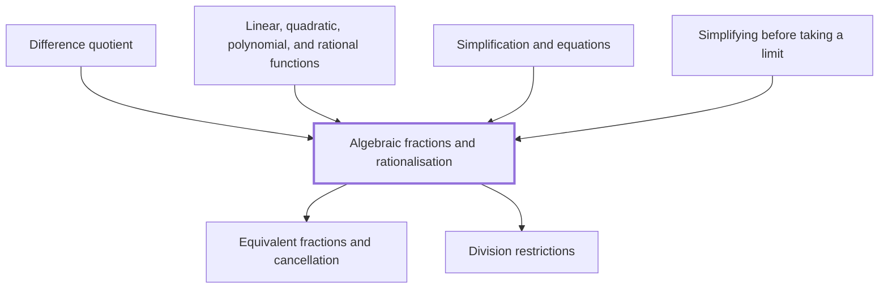

## In one sentence

## Why you need this

## The idea

## Worked example

## Common mistakes

## Builds on

<!-- generated:start builds-on -->
- [[Equivalent fractions and cancellation]] — Equivalent fractions are fractions with the same value, such as $\frac{2}{3}$ and $\frac{8}{12}$, and you get from one to another by multiplying or dividing the numerator and the denominator by the same non-zero number, which in the dividing direction is called cancelling.
- [[Division restrictions]] — Division restrictions are the values a letter cannot take because they would make a denominator equal to zero, and dividing by zero has no answer.
<!-- generated:end builds-on -->

## Required by

<!-- generated:start required-by -->
- [[Difference quotient]]
- [[Linear, quadratic, polynomial, and rational functions]]
- [[Simplification and equations]]
- [[Simplifying before taking a limit]]
<!-- generated:end required-by -->

<!-- generated:start mini-map -->

<!-- generated:end mini-map -->

## References
