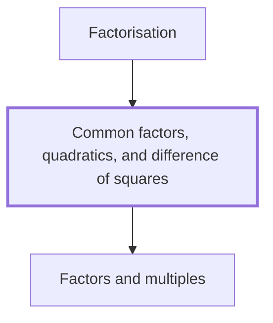

## In one sentence

## Why you need this

## The idea

## Worked example

## Common mistakes

## Builds on

<!-- generated:start builds-on -->
- [[Factors and multiples]] — A factor of a positive whole number is a positive whole number that divides it exactly, leaving no remainder, and a multiple of a positive whole number is that number times a positive whole number, so $3$ is a factor of $12$ and $12$ is a multiple of $3$.
<!-- generated:end builds-on -->

## Required by

<!-- generated:start required-by -->
- [[Factorisation]]
<!-- generated:end required-by -->

<!-- generated:start mini-map -->

<!-- generated:end mini-map -->

## References
