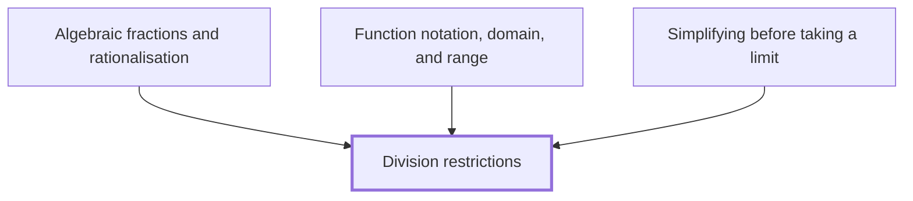

## In one sentence

Division restrictions are the values a letter cannot take because they would make a denominator equal to zero, and dividing by zero has no answer.

## Why you need this

Most expressions with a letter in them give a number for any number you put in. An expression with a letter in its denominator does not: some values break it. Before you work with such an expression, you need to know which values those are, and to find them without guessing.

Three later ideas lean on this. Working with fractions that have letters in them, and cancelling them, is [[Algebraic fractions and rationalisation]]. Saying which inputs a rule accepts is part of [[Function notation, domain, and range]]. Tidying an expression that has no value at a point, so you can see what happens near that point, is [[Simplifying before taking a limit]]. Each of them starts by asking where a denominator is zero.

## The idea

Division undoes multiplication. The statement $12 \div 3 = 4$ says that $4$ is the one number that gives $12$ when you multiply it by $3$: $4 \times 3 = 12$. Every division is a question of that kind. To work out $a \div b$, you look for the one number that gives $a$ when multiplied by $b$.

Ask that question with $0$ as the divisor and it fails.

- **Dividing $6$ by $0$.** You need a number that gives $6$ when multiplied by $0$. Any number multiplied by $0$ gives $0$, never $6$. No number works, so $6 \div 0$ has no answer.
- **Dividing $0$ by $0$.** You need a number that gives $0$ when multiplied by $0$. Now every number works: $5 \times 0 = 0$, and $-2 \times 0 = 0$, and $\frac{1}{4} \times 0 = 0$. A division has to give one answer, and this gives no single one, so $0 \div 0$ has no answer either.

So dividing by zero is **undefined**: the division has no value, not even $0$. This is a fact about the number system, not a rule you could choose to drop.

Zero on top is different. $0 \div 6 = 0$, because $0 \times 6 = 0$ and no other number does it. A fraction with $0$ as its numerator and a non-zero denominator is $0$; a fraction with $0$ as its denominator is undefined.

A fraction bar is a division sign, so $\frac{a}{b}$ means $a \div b$, and the same rule holds: the denominator must not be zero. When the denominator contains a letter, some value of the letter may make it zero. That value is **excluded**: the expression has no value there, and you cannot substitute it. You write the condition with $\neq$, read "is not equal to".

To find the excluded values of an expression:

1. Take each denominator on its own, and ask which value of the letter makes it $0$.
2. Find that value by working backwards from $0$, undoing each step the denominator does to the letter, the last step first. Each value you find is excluded. This works when the letter appears once in the denominator, as in every example here.
3. State the result: the letter can be any number except those values.

You never set the numerator equal to zero to find a restriction. A zero numerator over a non-zero denominator makes the whole fraction $0$, which is a perfectly good value.

## Worked example

Find the excluded value of $\frac{x + 1}{x - 3}$.

The denominator is $x - 3$: it takes $x$ and subtracts $3$. You want it to give $0$. Work backwards from $0$ and undo the subtraction by adding $3$:

$$0 + 3 = 3$$

So $x = 3$ is excluded, and you write $x \neq 3$. Check it by substituting $3$:

$$\frac{3 + 1}{3 - 3} = \frac{4}{0}$$

which is undefined. Every other value gives a number. At $x = 5$:

$$\frac{5 + 1}{5 - 3} = \frac{6}{2} = 3$$

At $x = -1$ the numerator is zero, and that is allowed:

$$\frac{-1 + 1}{-1 - 3} = \frac{0}{-4} = 0$$

Now a denominator with a number in front of the letter. Find the excluded value of $\frac{7}{2x + 5}$.

The denominator $2x + 5$ takes $x$, multiplies by $2$, then adds $5$. You want it to give $0$. Work backwards from $0$, undoing the last step first. Undo "add $5$" by subtracting $5$:

$$0 - 5 = -5$$

Then undo "multiply by $2$" by dividing by $2$:

$$-5 \div 2 = -\frac{5}{2}$$

So $x \neq -\frac{5}{2}$. Check: $2 \times \left(-\frac{5}{2}\right) + 5 = -5 + 5 = 0$, so the denominator is zero there.

```interactive
archetype: expression-stepper
steps:
  - latex: '\frac{7}{2x + 5}'
  - latex: '0'
    because: Take the denominator on its own. It must give 0, so start from 0 and work backwards.
  - latex: '0 - 5 = -5'
    because: The last step was add 5, so undo it first by subtracting 5.
  - latex: '-5 \div 2 = -\frac{5}{2}'
    because: The first step was multiply by 2, so undo it by dividing by 2.
  - latex: 'x \neq -\frac{5}{2}'
    because: This value makes the denominator zero, so x can be any number except it.
connective: none
caption: Only the denominator has to give 0. The numerator 7 plays no part in finding the restriction.
```

An expression can have more than one denominator. Take this sum:

$$\frac{1}{x} + \frac{4}{x + 2}$$

The first denominator is zero at $x = 0$. The second adds $2$ to $x$, so undo that from $0$: $0 - 2 = -2$, and it is zero at $x = -2$. Both are excluded: $x \neq 0$ and $x \neq -2$.

Reading off the working gives the general form. For a fraction whose denominator is an expression in $x$, find each value of $x$ that makes the denominator $0$, and every such value is one $x$ cannot take.

## Common mistakes

**Writing $5 \div 0 = 0$.** Check it by multiplying back: if $5 \div 0$ were $0$, then $0 \times 0$ would be $5$. It is $0$. No number times $0$ gives $5$, so $5 \div 0$ is undefined, not $0$.

**Writing that $0 \div 5$ is undefined.** The zero is on top here. $0 \div 5 = 0$, because $0 \times 5 = 0$. Only a zero denominator causes trouble.

**Setting the numerator to zero.** For $\frac{x - 4}{x + 1}$, a learner writes $x - 4 = 0$ and concludes $x \neq 4$. At $x = 4$ the expression is $\frac{0}{5} = 0$, a valid value. The restriction comes from the denominator: undoing "add $1$" from $0$ gives $0 - 1 = -1$, so $x \neq -1$.

**Undoing with the wrong sign.** For $\frac{3}{x + 6}$, a learner writes $x \neq 6$. Substitute $6$: the denominator is $6 + 6 = 12$, which is not zero. The denominator adds $6$, so undo it from $0$ by subtracting $6$: $0 - 6 = -6$, and $-6 + 6 = 0$, so the excluded value is $-6$ and the restriction is $x \neq -6$.

**Thinking $\frac{x - 3}{x - 3} = 1$ for every $x$.** It equals $1$ for every $x$ except $3$. At $x = 3$ it is $\frac{0}{0}$, which is undefined. The expression and the number $1$ agree everywhere but one point, and at that point the expression has no value. You meet this again in [[Simplifying before taking a limit]], an aside you can skip for now.

## Builds on

<!-- generated:start builds-on -->
*Nothing: this is a Floor Node, knowledge the Module assumes.*
<!-- generated:end builds-on -->

## Required by

<!-- generated:start required-by -->
- [[Algebraic fractions and rationalisation]]
- [[Function notation, domain, and range]]
- [[Simplifying before taking a limit]]
<!-- generated:end required-by -->

<!-- generated:start mini-map -->

<!-- generated:end mini-map -->

## References
