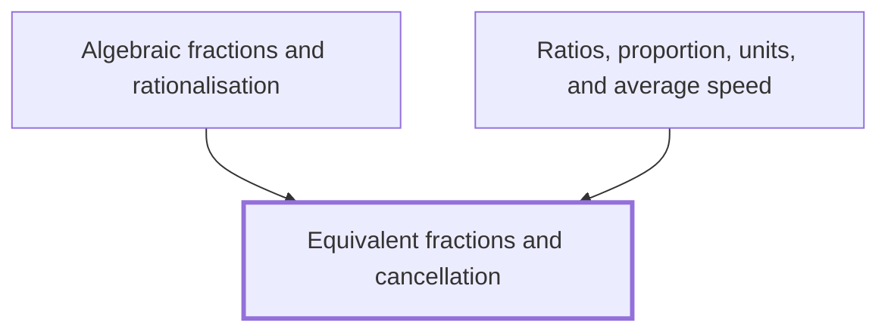

## In one sentence

Equivalent fractions are fractions with the same value, such as $\frac{2}{3}$ and $\frac{8}{12}$, and you get from one to another by multiplying or dividing the numerator and the denominator by the same non-zero number, which in the dividing direction is called cancelling.

## Why you need this

The same value can be written as a fraction in many ways. Equivalent fractions let you tell whether two fractions are equal, rewrite a fraction in its simplest form so it is easy to read and compare, and rewrite two fractions over a common denominator so you can add or compare them.

[[Algebraic fractions and rationalisation]] cancels fractions whose numerator and denominator contain letters, and its rule for what may be cancelled is the rule in this Note. [[Ratios, proportion, units, and average speed]] simplifies and scales ratios in the same way you simplify and scale fractions here.

## The idea

A fraction $\frac{a}{b}$ has a *numerator* $a$ on top and a *denominator* $b$ underneath. The denominator says how many equal parts a whole is cut into, and the numerator says how many of those parts you have. The denominator is never $0$. As an aside you can skip, [[Division restrictions]] explains why.

Cut a bar into $3$ equal parts and shade $2$: you have shaded $\frac{2}{3}$. Now cut every part into $4$ smaller equal parts. The bar has $3 \times 4 = 12$ parts, and the shading covers $2 \times 4 = 8$ of them. You have shaded $\frac{8}{12}$, and the shaded amount has not changed. So

$$\frac{2}{3} = \frac{2 \times 4}{3 \times 4} = \frac{8}{12}.$$

Fractions with the same value are *equivalent*. The rule is: **multiply or divide the numerator and the denominator by the same non-zero number, and the value stays the same.** Multiplying both by $4$ is the same as multiplying the whole fraction by $\frac{4}{4}$, which is $1$, and multiplying by $1$ changes nothing.

Dividing works in the other direction. If the numerator and the denominator share a factor, you can divide both by it. Crossing out that shared factor is called *cancelling*:

$$\frac{8}{12} = \frac{2 \times 4}{3 \times 4} = \frac{2}{3}.$$

What you cancel must be a *factor* of the whole numerator and a factor of the whole denominator: a number that multiplies everything above the line, and everything below it. You can never cancel a number that is only added or subtracted.

A fraction is in its *simplest form* when its numerator and denominator have no common factor other than $1$. You reach it in one step by dividing both by their highest common factor (HCF), or in several steps by cancelling smaller common factors until none is left. You meet the HCF again, as an aside, in [[Factors and multiples]].

To check whether two fractions are equivalent, rewrite them over the same denominator, or put both in simplest form, and compare.

## Worked example

**Simplify $\frac{18}{24}$.**

The factors of $18$ are $1, 2, 3, 6, 9, 18$. The factors of $24$ are $1, 2, 3, 4, 6, 8, 12, 24$. The highest common factor is $6$.

$$\frac{18}{24} = \frac{3 \times 6}{4 \times 6} = \frac{3}{4}.$$

The only common factor of $3$ and $4$ is $1$, so $\frac{3}{4}$ is the simplest form.

If you do not spot the HCF, cancel in steps. Both numbers are even, so divide by $2$, then both are multiples of $3$, so divide by $3$:

$$\frac{18}{24} = \frac{9}{12} = \frac{3}{4}.$$

```interactive
archetype: expression-stepper
steps:
  - latex: '\frac{18}{24}'
  - latex: '\frac{9 \times 2}{12 \times 2}'
    because: Both numbers are even, so 2 is a factor of the whole numerator and of the whole denominator.
  - latex: '\frac{9}{12}'
    because: Cancel the common factor 2.
  - latex: '\frac{3 \times 3}{4 \times 3}'
    because: Both 9 and 12 are multiples of 3.
  - latex: '\frac{3}{4}'
    because: Cancel the common factor 3. The only common factor of 3 and 4 is 1, so this is the simplest form.
caption: Every line has the same value. Each step cancels a factor that multiplies the whole top and the whole bottom.
```

**Are $\frac{6}{15}$ and $\frac{8}{20}$ equivalent?**

Cancel $3$ from the first and $4$ from the second:

$$\frac{6}{15} = \frac{2 \times 3}{5 \times 3} = \frac{2}{5}, \qquad \frac{8}{20} = \frac{2 \times 4}{5 \times 4} = \frac{2}{5}.$$

Both equal $\frac{2}{5}$, so they are equivalent.

**Write $\frac{5}{6}$ with denominator $24$.**

Since $6 \times 4 = 24$, multiply the numerator and the denominator by $4$:

$$\frac{5}{6} = \frac{5 \times 4}{6 \times 4} = \frac{20}{24}.$$

In general, for any non-zero number $k$,

$$\frac{a}{b} = \frac{ak}{bk}.$$

## Common mistakes

**Cancelling a number that is added, not multiplied.** A learner writes $\frac{2 + 3}{2 + 5} = \frac{3}{5}$ by crossing out the $2$s. But $\frac{2 + 3}{2 + 5} = \frac{5}{7}$, which is not $\frac{3}{5}$. The $2$ is not a factor of the numerator $5$ or of the denominator $7$: it is only one of the terms being added. You may cancel only a factor that multiplies the whole numerator and the whole denominator.

**Cancelling digits.** A learner writes $\frac{16}{64} = \frac{1}{4}$ by crossing out the two $6$s, then tries the same on $\frac{12}{24}$ and gets $\frac{1}{4}$. The first answer is correct by luck: $\frac{16}{64} = \frac{1 \times 16}{4 \times 16}$. The second is wrong, because $\frac{12}{24} = \frac{1 \times 12}{2 \times 12} = \frac{1}{2}$. A digit is not a factor: $16$ is $10 + 6$, not $1 \times 6$.

**Changing only the denominator.** A learner writes $\frac{3}{4} = \frac{3}{12}$ to get denominator $12$. Multiplying the denominator alone by $3$ cuts the whole into three times as many parts, so each part is a third of the size, and $\frac{3}{12}$ is a third of $\frac{3}{4}$. Multiply the numerator by $3$ as well: $\frac{3}{4} = \frac{9}{12}$.

**Adding the same number to top and bottom.** A learner thinks $\frac{1}{2} = \frac{1 + 1}{2 + 1} = \frac{2}{3}$. But $\frac{1}{2} = 0.5$ and $\frac{2}{3}$ is about $0.67$. Adding the same number to the numerator and the denominator usually changes the value. Multiplying or dividing both by the same non-zero number always keeps it.

## Builds on

<!-- generated:start builds-on -->
*Nothing: this is a Floor Node, knowledge the Module assumes.*
<!-- generated:end builds-on -->

## Required by

<!-- generated:start required-by -->
- [[Algebraic fractions and rationalisation]]
- [[Ratios, proportion, units, and average speed]]
<!-- generated:end required-by -->

<!-- generated:start mini-map -->

<!-- generated:end mini-map -->

## References
