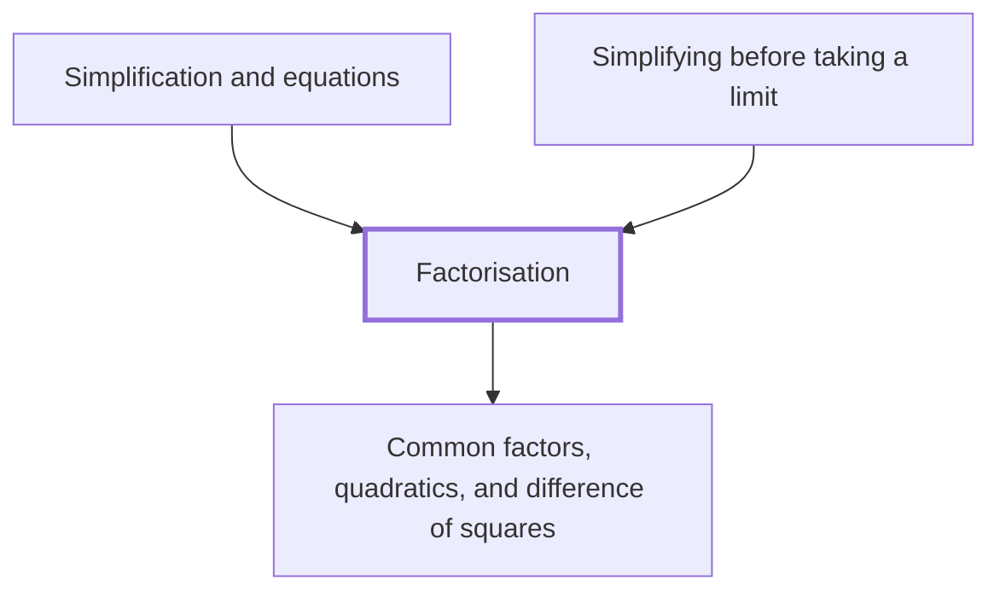

## In one sentence

## Why you need this

## The idea

## Worked example

## Common mistakes

## Builds on

<!-- generated:start builds-on -->
- [[Common factors, quadratics, and difference of squares]]
<!-- generated:end builds-on -->

## Required by

<!-- generated:start required-by -->
- [[Simplification and equations]]
- [[Simplifying before taking a limit]]
<!-- generated:end required-by -->

<!-- generated:start mini-map -->

<!-- generated:end mini-map -->

## References
