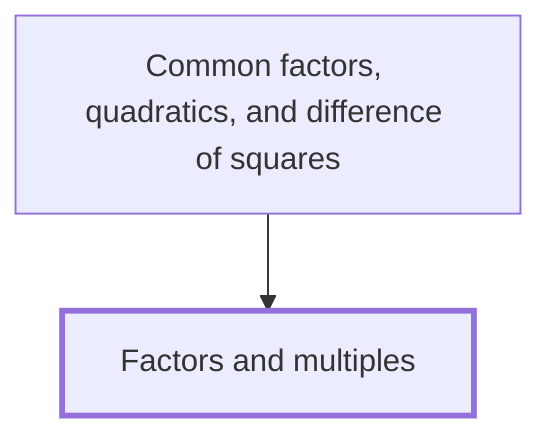

## In one sentence

A factor of a whole number divides it exactly, leaving no remainder, and a multiple of a whole number is that number times a whole number, so $3$ is a factor of $12$ and $12$ is a multiple of $3$.

## Why you need this

You use factors to cancel fractions and multiples to put fractions over a common denominator. In algebra, factorising an expression means writing it as a product, and every method for doing that starts from the factors of a number: you look for the highest common factor of the numbers in the expression, or for the pair of factors of one number that adds to another. You meet both moves again in [[Common factors, quadratics, and difference of squares]], which you can skip for now.

## The idea

Take a positive whole number, such as $12$. A whole number $a$ is a **factor** of $12$ when $12 \div a$ is a whole number. Since $12 \div 3 = 4$, the number $3$ is a factor of $12$. Since $12 \div 5 = 2.4$, the number $5$ is not.

Turn the same fact round and you get a multiple. $12$ is a **multiple** of $3$ because $12 = 3 \times 4$: it is $3$ times a whole number. The multiples of $3$ are $3, 6, 9, 12, 15, \ldots$, and they go on for ever, but no factor of a number is bigger than the number.

Factors come in **factor pairs**, two factors that multiply to give the number. For $12$ the pairs are

$$1 \times 12, \quad 2 \times 6, \quad 3 \times 4.$$

So the factors of $12$ are $1, 2, 3, 4, 6, 12$. A number with exactly two factors, $1$ and itself, such as $7$, is a **prime**.

To list every factor, test $1, 2, 3, \ldots$ in turn; each one that divides exactly gives a pair. Stop once the number you test, times itself, is bigger than your number: every later pair is one you already have, reversed.

Two numbers can share factors. A **common factor** of $8$ and $12$ divides both: $1$, $2$ and $4$. The largest, $4$, is the **highest common factor**, written HCF. Two numbers can also share multiples. A **common multiple** of $4$ and $6$ is a multiple of both, such as $12$, $24$ or $36$. The smallest, $12$, is the **lowest common multiple**, written LCM.

Negative whole numbers have factor pairs too. A negative times a negative is positive, so $(-3) \times (-4) = 12$, and each factor pair of $12$ has a negative twin. A negative number such as $-12$ has pairs with one positive and one negative factor: $3 \times (-4)$ and $(-3) \times 4$ both give $-12$.

## Worked example

**List the factors of $36$.** Test each number from $1$ upwards.

- $36 \div 1 = 36$, giving the pair $1 \times 36$.
- $36 \div 2 = 18$, giving $2 \times 18$.
- $36 \div 3 = 12$, giving $3 \times 12$.
- $36 \div 4 = 9$, giving $4 \times 9$.
- $36 \div 5 = 7.2$, not a whole number, so $5$ is not a factor.
- $36 \div 6 = 6$, giving $6 \times 6$. Write $6$ once.
- $7 \times 7 = 49$, which is bigger than $36$, so you stop.

The factors of $36$ are $1, 2, 3, 4, 6, 9, 12, 18, 36$.

**Find the HCF of $24$ and $36$.** The factor pairs of $24$ are $1 \times 24$, $2 \times 12$, $3 \times 8$ and $4 \times 6$, so its factors are $1, 2, 3, 4, 6, 8, 12, 24$. The numbers in both lists are $1, 2, 3, 4, 6, 12$. The highest is $12$. Check: $24 \div 12 = 2$ and $36 \div 12 = 3$, both whole numbers.

**Find the LCM of $4$ and $6$.** List multiples of each:

- multiples of $4$: $4, 8, 12, 16, 20, 24, \ldots$
- multiples of $6$: $6, 12, 18, 24, \ldots$

The first number in both lists is $12$, so the LCM is $12$.

**Find the factor pair of $12$ that adds to $7$, and the one that adds to $-7$.** Add each pair: $1 + 12 = 13$, $2 + 6 = 8$, $3 + 4 = 7$. The pair is $3$ and $4$. For $-7$, use the negative twin: $(-3) \times (-4) = 12$ and $(-3) + (-4) = -7$.

In general, whenever $a \times b = n$ for whole numbers, $a$ and $b$ are factors of $n$, and $n$ is a multiple of each.

## Common mistakes

**Writing multiples as factors: "the factors of $6$ are $6, 12, 18$".** Those are multiples of $6$. A factor of $6$ must divide $6$, and $6 \div 12 = 0.5$ is not a whole number. The factors of $6$ are $1, 2, 3, 6$.

**Leaving out $1$ and the number itself: "the factors of $12$ are $2, 3, 4, 6$".** Since $12 = 1 \times 12$, both $1$ and $12$ divide $12$ exactly. The full list is $1, 2, 3, 4, 6, 12$.

**Taking the product as the LCM: "the LCM of $4$ and $6$ is $4 \times 6 = 24$".** $24$ is a common multiple, but $12$ is smaller and both divide it: $12 \div 4 = 3$ and $12 \div 6 = 2$. The product is a common multiple, not always the lowest.

**Swapping HCF and LCM: "the HCF of $24$ and $36$ is $72$".** $72$ is a common multiple. A common factor divides both numbers, so it can be no bigger than the smaller number, $24$. The HCF is $12$.

**Counting $1$ as a prime.** A prime has exactly two factors, but $1$ has only one, itself. The smallest prime is $2$.

## Builds on

<!-- generated:start builds-on -->
*Nothing: this is a Floor Node, knowledge the Module assumes.*
<!-- generated:end builds-on -->

## Required by

<!-- generated:start required-by -->
- [[Common factors, quadratics, and difference of squares]]
<!-- generated:end required-by -->

<!-- generated:start mini-map -->

<!-- generated:end mini-map -->

## References
