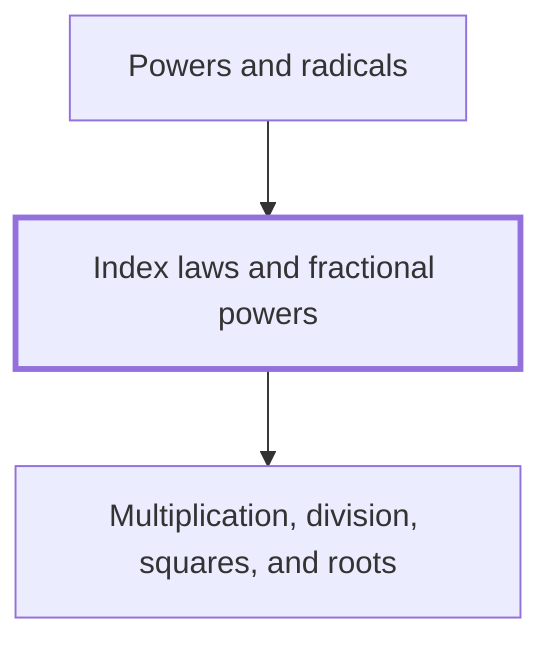

## In one sentence

## Why you need this

## The idea

## Worked example

## Common mistakes

## Builds on

<!-- generated:start builds-on -->
- [[Multiplication, division, squares, and roots]] — Multiplication and division undo each other, squaring a number multiplies it by itself, and the square root of a number is the non-negative number whose square it is.
<!-- generated:end builds-on -->

## Required by

<!-- generated:start required-by -->
- [[Powers and radicals]]
<!-- generated:end required-by -->

<!-- generated:start mini-map -->

<!-- generated:end mini-map -->

## References
