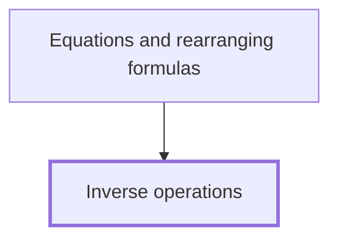

## In one sentence

An inverse operation undoes another operation, so subtraction undoes addition, division undoes multiplication by a number other than $0$, and taking the square root undoes squaring a number that is positive or $0$.

## Why you need this

Inverse operations let you work backwards: from the answer to a calculation, you recover the number you started with. [[Equations and rearranging formulas]] builds on this idea directly: there you undo the steps that were done to an unknown number, one at a time, until the number stands on its own. That Note does the solving; this one gives you the undoing it is made from.

## The idea

An operation does something to a number. "Add $5$" takes $3$ to $8$. Its **inverse operation** takes the result back to where it started: "subtract $5$" takes $8$ back to $3$. Doing an operation and then its inverse leaves you with the number you began with, whatever that number was.

The pairs you use are these:

- **Adding and subtracting the same number.** Add $7$ to $10$ and you get $17$; subtract $7$ from $17$ and you are back at $10$. Each one undoes the other.
- **Multiplying and dividing by the same number.** Multiply $6$ by $4$ and you get $24$; divide $24$ by $4$ and you are back at $6$. The number must not be $0$: multiplying by $0$ sends every number to $0$, so no division can tell you where you started, and dividing by $0$ has no meaning. If you want more on why, [[Division restrictions]] looks at it; you can skip that aside here.
- **Squaring and taking the square root.** Square $5$ and you get $25$; the square root of $25$ is $5$. This pair needs care with negative numbers, which the second common mistake below shows.

### Undoing several steps

Often a number goes through more than one operation in a row. To undo them, you undo the **last** step **first**, then work back through the steps in reverse order. Think of getting dressed: you put on socks and then shoes, so to undress you take off the shoes first and the socks second.

A later step acts on the result of the earlier ones. If a number was multiplied by $3$ and then had $4$ added, the $4$ was added on top of the product. You have to take that $4$ away before the product is back on its own and you can divide by $3$.

## Worked example

Someone thinks of a number. They multiply it by $3$, then add $4$, and they get $19$. What number did they think of?

Write the steps forwards, in the order they were done:

$$\text{start} \xrightarrow{\ \times 3\ } \ ? \ \xrightarrow{\ +4\ } 19$$

Now undo them backwards, last step first.

1. The last step was "add $4$". Its inverse is "subtract $4$": $19 - 4 = 15$. So the number before $4$ was added was $15$.
2. The step before that was "multiply by $3$". Its inverse is "divide by $3$": $15 \div 3 = 5$. So the starting number was $5$.

Check by running the steps forwards from $5$: $5 \times 3 = 15$, then $15 + 4 = 19$. That matches, so the starting number is $5$.

```interactive
archetype: function-machine
machines:
  - family: linear
    coefficients: [3, 0]
    label: '\times 3'
  - family: linear
    coefficients: [1, 4]
    label: '+4'
input: 5
undo: reversed-and-wrong
caption: Undo the last step first and 19 goes back to 15, then 5. Divide first and you reach 2 and a third, which runs forwards to 11, not 19.
```

A second example, with a square. A positive number is squared, then $2$ is subtracted, and the result is $47$. Undo the last step first: the inverse of "subtract $2$" is "add $2$", so $47 + 2 = 49$. Then the inverse of "square" is "take the square root", and $\sqrt{49} = 7$. Check: $7 \times 7 = 49$ and $49 - 2 = 47$. Without the word *positive*, the starting number could also have been $-7$, since $(-7) \times (-7) = 49$ too.

```interactive
archetype: function-machine
machines:
  - family: quadratic
    coefficients: [1, 0, 0]
    label: '\text{square}'
  - family: linear
    coefficients: [1, -2]
    label: '-2'
input: 7
undo: reversed
decimals: 0
caption: Adding 2 takes 47 back to 49, but 7 and -7 both square to 49, so only the word positive tells you the start was 7.
```

## Common mistakes

**Undoing the steps in the order they were done.** For the number that was multiplied by $3$, then had $4$ added, to give $19$, a learner divides first: $19 \div 3 = 6\frac{1}{3}$, then subtracts $4$ to get $2\frac{1}{3}$. Checking forwards, $2\frac{1}{3} \times 3 = 7$ and $7 + 4 = 11$, not $19$. The $4$ was added last, on top of the product, so it has to come off first: $19 - 4 = 15$, then $15 \div 3 = 5$.

**Thinking the square root always gives back the number that was squared.** Squaring $-3$ gives $(-3) \times (-3) = 9$, and $\sqrt{9} = 3$, not $-3$. The sign $\sqrt{\ }$ always means the root that is positive or $0$. Squaring sends $3$ and $-3$ to the same $9$, so from $9$ alone you cannot tell which one you started with: the starting number is $3$ or $-3$. The square root undoes squaring only when you know the starting number was positive or $0$.

**Using the wrong operation as the inverse.** A learner undoes "multiply by $4$" by subtracting $4$: from $24$, they get $20$. But $20 \times 4 = 80$, not $24$. The inverse of multiplying by $4$ is dividing by $4$, which gives $24 \div 4 = 6$, and $6 \times 4 = 24$.

**Thinking every operation can be undone.** A learner tries to undo "multiply by $0$" by dividing by $0$. But $5 \times 0 = 0$ and $8 \times 0 = 0$, so the result $0$ does not say which number you started with, and division by $0$ has no meaning. Multiplying by $0$ has no inverse.

## Builds on

<!-- generated:start builds-on -->
*Nothing: this is a Floor Node, knowledge the Module assumes.*
<!-- generated:end builds-on -->

## Required by

<!-- generated:start required-by -->
- [[Equations and rearranging formulas]]
<!-- generated:end required-by -->

<!-- generated:start mini-map -->

<!-- generated:end mini-map -->

## References
