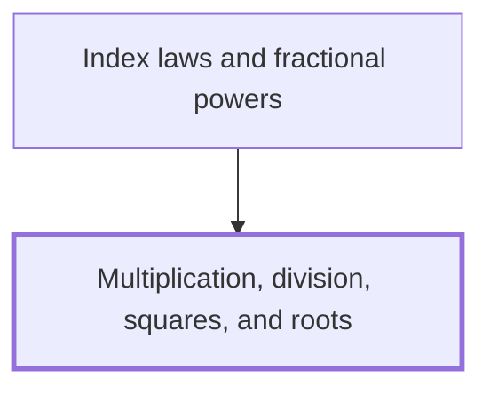

## In one sentence

Multiplication and division undo each other, squaring a number multiplies it by itself, and the square root of a number is the non-negative number whose square it is.

## Why you need this

Almost every line of working in calculus multiplies, divides, squares or takes a root. You use these four operations to work out the output of a formula, to tidy an answer into its simplest form, and to check whether two expressions agree. [[Index laws and fractional powers]] builds directly on them: it writes repeated multiplication as a power, and a root as a power too, so it needs you to handle squares and square roots with confidence first.

## The idea

**Multiplication and division.** $3 \times 4$ means three groups of four, which is $12$. Order does not matter: $4 \times 3$ is also $12$. Division asks the reverse question. $12 \div 4$ asks "what do you multiply $4$ by to get $12$?", and the answer is $3$. So dividing by $4$ undoes multiplying by $4$. You also write a division as a fraction: $\frac{12}{4} = 3$.

Signs follow two rules, for multiplication and division alike. Two numbers with the same sign give a positive answer: $(-3) \times (-4) = 12$. Two numbers with different signs give a negative answer: $(-12) \div 4 = -3$.

You can never divide by $0$. If $5 \div 0$ were some number, then that number times $0$ would be $5$. But any number times $0$ is $0$, so no such number exists.

**Squares.** To square a number, multiply it by itself. You write the square of $5$ as $5^2$, read "five squared":

$$5^2 = 5 \times 5 = 25.$$

The small raised $2$ is called the *index*, and $5^2$ is a *power* of $5$. A negative number squared is positive, because it is a negative times a negative: $(-5)^2 = 25$. So no square is ever negative.

**Square roots.** The square root reverses squaring. The square root of $25$, written $\sqrt{25}$, is the number that squares to give $25$. Both $5$ and $-5$ square to $25$, so to give $\sqrt{25}$ one value, the symbol always means the one that is not negative: $\sqrt{25} = 5$. When you want both, write $\pm\sqrt{25}$, which means $5$ or $-5$.

Since no square is negative, a negative number has no square root among the numbers you use here: $\sqrt{-25}$ has no value.

**Order of operations.** When a calculation mixes these operations, follow BIDMAS: brackets first, then indices (such as squares), then multiplication and division, then addition and subtraction. Multiplication and division share one rank, so you work them from left to right. A square root sign acts like a bracket around everything under it.

## Worked example

Work out $\dfrac{3 \times 4^2 - 12}{\sqrt{81} \div 3}$.

The top line comes first.

1. Indices come before multiplication, so square first: $4^2 = 4 \times 4 = 16$.
2. Multiply: $3 \times 16 = 48$.
3. Subtract: $48 - 12 = 36$.

Then the bottom line.

4. $9 \times 9 = 81$, and $9$ is not negative, so $\sqrt{81} = 9$.
5. Divide: $9 \div 3 = 3$.

Finally, divide the top line by the bottom line:

$$\frac{36}{3} = 12.$$

Check the answer by undoing the last step: $12 \times 3 = 36$, which is the top line.

```interactive
archetype: expression-stepper
steps:
  - latex: '\dfrac{3 \times 4^2 - 12}{\sqrt{81} \div 3}'
  - latex: '\dfrac{3 \times 16 - 12}{\sqrt{81} \div 3}'
    because: Indices come before multiplication, so square first. 4 times 4 is 16.
  - latex: '\dfrac{48 - 12}{\sqrt{81} \div 3}'
    because: Multiply. 3 times 16 is 48.
  - latex: '\dfrac{36}{\sqrt{81} \div 3}'
    because: Subtract. 48 minus 12 is 36, which finishes the top line.
  - latex: '\dfrac{36}{9 \div 3}'
    because: 9 times 9 is 81, and 9 is not negative, so the square root of 81 is 9.
  - latex: '\dfrac{36}{3}'
    because: Divide. 9 divided by 3 is 3, which finishes the bottom line.
  - latex: '12'
    because: Divide the top line by the bottom line.
caption: Every line is the same number. Indices go first, then multiplication and division, then subtraction.
```

Now a second one with a negative number: work out $\sqrt{(-6)^2 + 64}$.

1. The bracket says square $-6$ itself: $(-6)^2 = (-6) \times (-6) = 36$, positive because the signs are the same.
2. Add under the root sign: $36 + 64 = 100$.
3. $10 \times 10 = 100$, so $\sqrt{100} = 10$.

## Common mistakes

**Writing $-3^2 = 9$.** Indices come before the minus sign, so $-3^2$ means $-(3^2) = -9$. Only $(-3)^2$, with the bracket, squares the $-3$ itself and gives $9$.

**Writing $\sqrt{9 + 16} = \sqrt{9} + \sqrt{16} = 7$.** A root does not split over addition. Add first: $\sqrt{9 + 16} = \sqrt{25} = 5$, not $7$. The same holds for squares: $(3 + 4)^2 = 7^2 = 49$, but $3^2 + 4^2 = 25$.

**Writing $\sqrt{49} = -7$, or $\sqrt{49} = \pm 7$.** It is true that $(-7)^2 = 49$, but the symbol $\sqrt{49}$ means the root that is not negative, which is $7$. Write $\pm\sqrt{49}$ when you mean both $7$ and $-7$.

**Writing $12 \div 2 \times 3 = 2$.** This works the multiplication first, as $12 \div 6$. Multiplication and division share one rank, so work from left to right: $12 \div 2 = 6$, then $6 \times 3 = 18$.

**Writing $5^2 = 10$.** This multiplies $5$ by the index. Squaring multiplies the number by itself: $5^2 = 5 \times 5 = 25$.

**Thinking $(-4) \times (-2) = -8$.** Two negatives have the same sign, so the product is positive: $(-4) \times (-2) = 8$. You can check it with division: $8 \div (-2) = -4$, as it should be.

## Builds on

<!-- generated:start builds-on -->
*Nothing: this is a Floor Node, knowledge the Module assumes.*
<!-- generated:end builds-on -->

## Required by

<!-- generated:start required-by -->
- [[Index laws and fractional powers]]
<!-- generated:end required-by -->

<!-- generated:start mini-map -->

<!-- generated:end mini-map -->

## References
