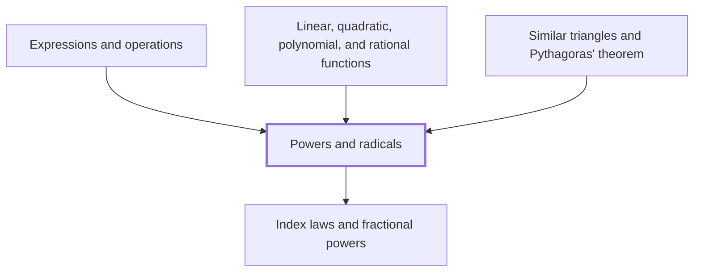

## In one sentence

## Why you need this

## The idea

## Worked example

## Common mistakes

## Builds on

<!-- generated:start builds-on -->
- [[Index laws and fractional powers]]
<!-- generated:end builds-on -->

## Required by

<!-- generated:start required-by -->
- [[Expressions and operations]]
- [[Linear, quadratic, polynomial, and rational functions]]
- [[Similar triangles and Pythagoras' theorem]]
<!-- generated:end required-by -->

<!-- generated:start mini-map -->

<!-- generated:end mini-map -->

## References
