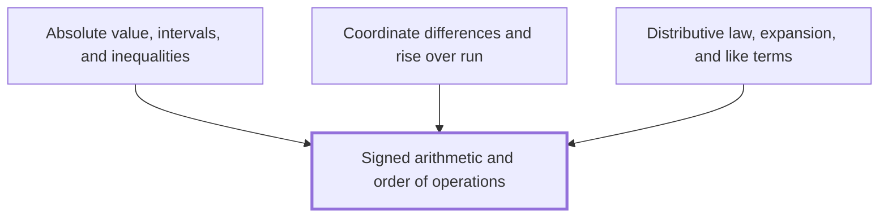

## In one sentence

Signed arithmetic is the set of rules for adding, subtracting, multiplying and dividing positive and negative numbers, and the order of operations, BIDMAS, fixes which part of a calculation you work out first.

## Why you need this

Most working in this Module mixes negative numbers with several operations, and one slip in a sign or in the order changes the answer. To find the distance between two numbers in [[Absolute value, intervals, and inequalities]], you subtract one signed number from another. To find how far a line rises between two points in [[Coordinate differences and rise over run]], you subtract coordinates that are often negative. To expand brackets in [[Distributive law, expansion, and like terms]], you multiply signs together term by term. As an aside you can skip: a negative answer later tells you that a line falls from left to right, in [[Slope of a straight line]].

## The idea

**Adding and subtracting.** On the number line, negative numbers sit left of $0$ and positive numbers right of it. Adding a positive number moves you right; adding a negative number moves you left. So $5 + (-8)$ starts at $5$ and moves $8$ to the left, landing on $-3$.

Subtracting does the opposite: subtracting a positive moves you left, and subtracting a negative moves you right. So taking away a negative is the same as adding a positive:

$$4 - (-6) = 4 + 6 = 10.$$

A minus sign in front of a negative number turns it into a positive one: $-(-6) = 6$.

**Multiplying and dividing.** Work out the size of the answer from the sizes of the numbers, then fix the sign:

- two numbers with the same sign give a positive answer: $(-3) \times (-4) = 12$;
- two numbers with different signs give a negative answer: $(-3) \times 4 = -12$ and $12 \div (-4) = -3$.

With more than two numbers, first look for a $0$. If you divide by $0$ anywhere, there is no answer, because dividing by $0$ has no meaning. If you multiply by $0$, or $0$ is the first number, the answer is $0$. Otherwise, count the negative signs. An even number of them gives a positive answer, and an odd number gives a negative one: $(-1) \times (-2) \times (-3) = -6$.

**Order of operations.** With several operations, you work them in this order, called **BIDMAS**:

1. **B**rackets: work out anything inside brackets first.
2. **I**ndices: then powers, such as $2^3 = 8$. In $2^3$ the $3$ is the *index*.
3. **D**ivision and **M**ultiplication: these share one rank. Work them from left to right.
4. **A**ddition and **S**ubtraction: these also share one rank. Work them from left to right.

D comes before M, and A before S, but neither pair is ranked: within each pair you go left to right. So $8 - 3 + 2 = 7$, not $3$, and $12 \div 3 \times 2 = 8$, not $2$.

The same rule goes by other names: BODMAS (*Orders* or *Of* for indices) in UK and Commonwealth schools and older texts, PEMDAS (*Parentheses, Exponents*) in US schools, and BEDMAS in Canadian schools. Each letter order wrongly suggests a ranking within each pair.

**Indices and negative numbers.** An index applies only to what comes directly before it, a single number or a whole bracket, called the *base*. In $(-3)^2$ the bracket makes the whole of $-3$ the base, so $(-3)^2 = (-3) \times (-3) = 9$. In $-3^2$ there is no bracket, so the index applies to the $3$ alone and the minus is taken afterwards: $-3^2 = -(3 \times 3) = -9$.

## Worked example

Work out $(-2)^3 - 4 \times (5 - 8) \div 6$.

**Brackets.** Inside the bracket, $5 - 8 = -3$. The calculation is now

$$(-2)^3 - 4 \times (-3) \div 6.$$

**Indices.** $(-2)^3 = (-2) \times (-2) \times (-2)$. Three negative signs is an odd number, so the answer is negative: $(-2)^3 = -8$. The calculation is now

$$-8 - 4 \times (-3) \div 6.$$

**Division and multiplication, left to right.** The signs differ, so $4 \times (-3) = -12$. Next comes $-12 \div 6 = -2$. The calculation is now

$$-8 - (-2).$$

**Addition and subtraction.** Subtracting $-2$ is the same as adding $2$:

$$-8 - (-2) = -8 + 2 = -6.$$

So $(-2)^3 - 4 \times (5 - 8) \div 6 = -6$.

```interactive
archetype: expression-stepper
steps:
  - latex: '(-2)^3 - 4 \times (5 - 8) \div 6'
  - latex: '(-2)^3 - 4 \times (-3) \div 6'
    because: Brackets come first, and 5 - 8 = -3.
  - latex: '-8 - 4 \times (-3) \div 6'
    because: Indices next. Three negative signs is an odd number, so (-2) cubed is -8.
  - latex: '-8 - (-12) \div 6'
    because: Division and multiplication share one rank, so go left to right. The signs differ, so 4 times -3 is -12.
  - latex: '-8 - (-2)'
    because: Then -12 divided by 6 is -2.
  - latex: '-8 + 2'
    because: Subtracting -2 is the same as adding 2.
  - latex: '-6'
caption: Each line is the same calculation, worked one BIDMAS rank at a time.
```

## Common mistakes

**Writing $-3^2 = 9$.** The index belongs to the $3$ alone, because there is no bracket around $-3$. Square first, then take the minus: $-3^2 = -9$. Only $(-3)^2$ equals $9$.

**Writing $10 - 4 + 3 = 3$** by adding $4 + 3$ first. Addition and subtraction share one rank, so you go left to right: $10 - 4 = 6$, then $6 + 3 = 9$.

**Writing $24 \div 4 \times 2 = 3$** by working $4 \times 2$ first. Division and multiplication also share one rank: $24 \div 4 = 6$, then $6 \times 2 = 12$.

**Writing $7 - (-5) = 2$.** Subtracting a negative moves you right on the number line, not left: $7 - (-5) = 7 + 5 = 12$.

**Thinking a negative times a negative is negative**, as in $(-6) \times (-2) = -12$. Two numbers with the same sign multiply to a positive answer, so $(-6) \times (-2) = 12$. Check it with a pattern: $(-6) \times 2 = -12$, $(-6) \times 1 = -6$, $(-6) \times 0 = 0$. Each step down in the second number adds $6$, so $(-6) \times (-1) = 6$ and $(-6) \times (-2) = 12$.

## Builds on

<!-- generated:start builds-on -->
*Nothing: this is a Floor Node, knowledge the Module assumes.*
<!-- generated:end builds-on -->

## Required by

<!-- generated:start required-by -->
- [[Absolute value, intervals, and inequalities]]
- [[Coordinate differences and rise over run]]
- [[Distributive law, expansion, and like terms]]
<!-- generated:end required-by -->

<!-- generated:start mini-map -->

<!-- generated:end mini-map -->

## References
