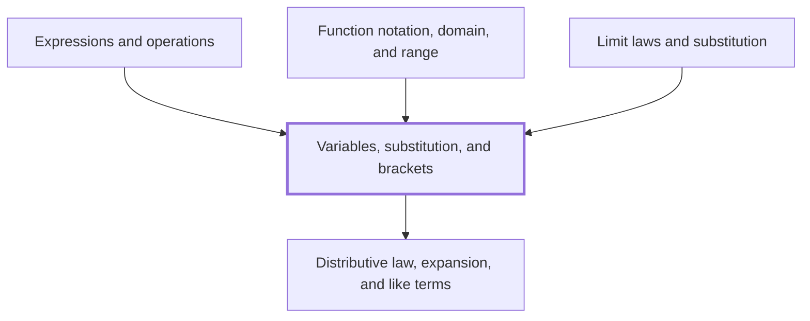

## In one sentence

## Why you need this

## The idea

## Worked example

## Common mistakes

## Builds on

<!-- generated:start builds-on -->
- [[Distributive law, expansion, and like terms]]
<!-- generated:end builds-on -->

## Required by

<!-- generated:start required-by -->
- [[Expressions and operations]]
- [[Function notation, domain, and range]]
- [[Limit laws and substitution]]
<!-- generated:end required-by -->

<!-- generated:start mini-map -->

<!-- generated:end mini-map -->

## References
