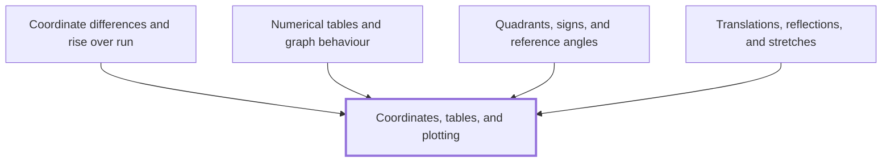

## In one sentence

Coordinates name each point on a grid by an ordered pair $(x, y)$, measured from the origin along a horizontal $x$-axis and a vertical $y$-axis, and a table of values for a rule turns into a graph when you plot each pair as a point and join the points.

## Why you need this

Almost every idea in calculus is drawn on a pair of axes, so you need to move between three forms of the same information: a rule, a table of its values, and a graph. Plotting points and reading them back lets you check each form against the others.

[[Coordinate differences and rise over run]] subtracts the coordinates of two points. [[Numerical tables and graph behaviour]] reads a table to see what a graph does. [[Quadrants, signs, and reference angles]] sorts points by the signs of their coordinates. [[Translations, reflections, and stretches]] moves every point of a graph and tracks its coordinates.

## The idea

Draw a horizontal number line and a vertical number line that cross at $0$ on both. The horizontal line is the **$x$-axis** and the vertical line is the **$y$-axis**. The point where they cross is the **origin**. On the $x$-axis, positive numbers lie to the right of the origin and negative numbers to the left. On the $y$-axis, positive numbers lie above the origin and negative numbers below.

Any point on the grid is named by two numbers written in brackets, $(x, y)$, called its **coordinates**. The first number, the **$x$-coordinate**, says how far to move across from the origin: right if it is positive, left if it is negative. The second number, the **$y$-coordinate**, says how far to move up or down: up if it is positive, down if it is negative. Because the order matters, $(x, y)$ is called an **ordered pair**. The origin is $(0, 0)$.

To **plot** a point, start at the origin, move across by the $x$-coordinate, then up or down by the $y$-coordinate, and mark a dot. To **read** a point, go the other way: drop a line straight down or up to the $x$-axis to find $x$, and go straight across to the $y$-axis to find $y$.

A rule such as $y = 2x + 1$ gives a $y$ for each $x$ you choose. A **table of values** lists some choices of $x$ in one row and the $y$ each one gives in the row below. Each column is one ordered pair, so one point. Plot every column, then join the points in order of $x$. For a straight-line rule, use a ruler. For a curved rule such as $y = x^2 - 2$, draw a smooth curve through the points, not straight segments from dot to dot. Some rules have a sharp corner or a gap, so when you are unsure what happens between two points, work out the $y$ for an $x$ between them and plot that too.

## Worked example

Plot the graph of $y = x^2 - 2$ for $x$ from $-2$ to $2$.

Work out $y$ for each whole number $x$, squaring before you subtract:

- $x = -2$: $(-2)^2 - 2 = 4 - 2 = 2$
- $x = -1$: $(-1)^2 - 2 = 1 - 2 = -1$
- $x = 0$: $0^2 - 2 = 0 - 2 = -2$
- $x = 1$: $1^2 - 2 = 1 - 2 = -1$
- $x = 2$: $2^2 - 2 = 4 - 2 = 2$

Write these as a table:

$$
\begin{array}{c|c|c|c|c|c}
x & -2 & -1 & 0 & 1 & 2 \\
\hline
y & 2 & -1 & -2 & -1 & 2
\end{array}
$$

Each column is a point: $(-2, 2)$, $(-1, -1)$, $(0, -2)$, $(1, -1)$ and $(2, 2)$.

Plot $(-2, 2)$: from the origin, move $2$ left, then $2$ up. Plot $(-1, -1)$: move $1$ left, then $1$ down. Plot $(0, -2)$: do not move across, then move $2$ down, so it sits on the $y$-axis. Plot $(1, -1)$ and $(2, 2)$ the same way, moving right.

```interactive
archetype: grid-plotter
task: plot-from-table
points:
  - [-2, 2]
  - [-1, -1]
  - [0, -2]
  - [1, -1]
  - [2, 2]
x-range: [-3, 3]
y-range: [-3, 3]
caption: Each column of the table is one point, across by x and then up or down by y. The five points make a U, lowest at (0, -2).
```

Join the five points with one smooth curve. It is U-shaped, lowest at $(0, -2)$, and the left half mirrors the right half.

Now read a point back. The curve crosses the $x$-axis, where $y = 0$, between $x = 1$ and $x = 2$; a careful drawing gives about $x = 1.4$. Check with the rule: $1.4^2 - 2 = 1.96 - 2 = -0.04$, close to $0$.

## Common mistakes

**Plotting $(3, 1)$ by moving $3$ up and $1$ across.** The order of an ordered pair is fixed: across first, then up or down. Moving $3$ up and $1$ across lands on $(1, 3)$, a different point.

**Working out $(-2)^2 - 2$ as $-4 - 2 = -6$.** The square applies to the whole of $-2$, and a negative times a negative is positive: $(-2) \times (-2) = 4$. So $(-2)^2 - 2 = 4 - 2 = 2$, and the point is $(-2, 2)$, not $(-2, -6)$.

**Joining the points of $y = x^2 - 2$ with straight lines.** Straight segments give a shape with sharp corners at the plotted points. At $x = 0.5$ the rule gives $0.25 - 2 = -1.75$, but the segment from $(0, -2)$ to $(1, -1)$ passes through $(0.5, -1.5)$. The rule bends between the points, so draw a smooth curve.

**Labelling the $x$-axis left of the origin $-3$, $-2$, $-1$, with $-3$ next to the origin.** Each negative number sits as far left of the origin as its positive partner sits to the right, so moving left from the origin gives $-1$, then $-2$, then $-3$. With the wrong labels, $(-3, 0)$ is plotted where $(-1, 0)$ belongs.

## Builds on

<!-- generated:start builds-on -->
*Nothing: this is a Floor Node, knowledge the Module assumes.*
<!-- generated:end builds-on -->

## Required by

<!-- generated:start required-by -->
- [[Coordinate differences and rise over run]]
- [[Numerical tables and graph behaviour]]
- [[Quadrants, signs, and reference angles]]
- [[Translations, reflections, and stretches]]
<!-- generated:end required-by -->

<!-- generated:start mini-map -->

<!-- generated:end mini-map -->

## References
