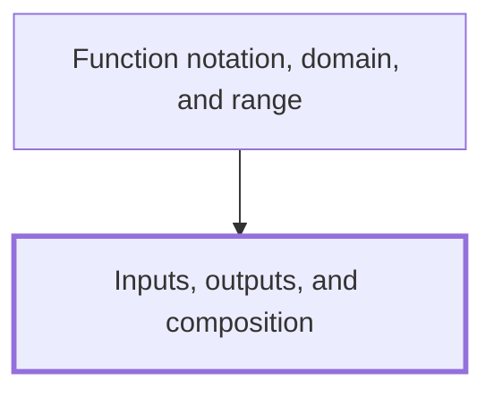

## In one sentence

A function is a rule that turns each input into exactly one output, and composing two functions means feeding the output of the first in as the input of the second.

## Why you need this

Calculus asks how an output changes when you change its input. To ask that, you need to see a formula such as $2x + 1$ as a machine: a number goes in and one number comes out. You also need to build a long rule out of short ones and take it apart again, which is how later Notes handle large formulas.

[[Function notation, domain, and range]] gives these ideas their names and their shorthand. It needs you to arrive knowing what an input and an output are, that one input gives one output, and what it means to run one rule after another.

## The idea

A *function* is a rule that takes a number, the *input*, and gives back a number, the *output*. Picture a machine: the input goes in, the output comes out. The rule "multiply by $2$, then add $1$" takes the input $3$ and gives the output $2 \times 3 + 1 = 7$.

The one requirement is this: each input gives **exactly one** output. Put $3$ in today or tomorrow and $7$ comes out every time. A rule that could give two different outputs for the same input is not a function.

Two different inputs may share an output. The rule "square it" sends $3$ to $9$ and $-3$ to $9$ as well. That is allowed: each input still has only one output.

You can write a rule with a letter standing for the input. If $x$ is the input, "multiply by $2$, then add $1$" is $2x + 1$. To find an output, replace $x$ with the input and work it out. A table of inputs and outputs records what the rule does:

| Input | $-1$ | $0$ | $1$ | $2$ | $3$ |
|---|---|---|---|---|---|
| Output of $2x + 1$ | $-1$ | $1$ | $3$ | $5$ | $7$ |

As an aside you can skip, you meet inputs that close in on one value from either side, while you watch their outputs, in [[Left-hand and right-hand limits]].

*Composition* is running one function after another. You put a number into the first machine, take what comes out, and put that into the second machine. The output of the second machine is the output of the whole chain. Joined like this, the two machines act as one new function: it still takes one input and gives one output.

Order matters. Running the first machine then the second usually gives a different answer from running the second then the first, so whenever you compose, say which rule acts first.

You can also read composition backwards. The rule $(x + 3)^2$ is "add $3$" followed by "square it": the bracket tells you which step happens first. Spotting the steps inside a long rule is called *decomposing* it.

## Worked example

Take two rules: rule A is "add $3$", and rule B is "square it".

**Rule A first, then rule B, with input $2$.**

1. Rule A acts on $2$: $2 + 3 = 5$.
2. The output $5$ becomes the input of rule B: $5^2 = 25$.

The chain sends $2$ to $25$.

**Rule B first, then rule A, with input $2$.**

1. Rule B acts on $2$: $2^2 = 4$.
2. The output $4$ becomes the input of rule A: $4 + 3 = 7$.

The chain sends $2$ to $7$. Swapping the order changed the output from $25$ to $7$.

**Both orders with input $-1$.**

- A then B: $-1 + 3 = 2$, then $2^2 = 4$.
- B then A: $(-1)^2 = 1$, then $1 + 3 = 4$.

Both give $4$ here, but one matching input does not make the orders the same: the input $2$ already showed they differ.

**The general rule, read off the numbers.** In "A then B" you added $3$ and then squared the whole result, so with input $x$ the output is

$$(x + 3)^2.$$

In "B then A" you squared and then added $3$, so the output is

$$x^2 + 3.$$

Check with $x = 2$: $(2 + 3)^2 = 25$ and $2^2 + 3 = 7$, matching the chains above.

## Common mistakes

**Running the rules in the wrong order.** Asked for "add $3$, then square" at the input $2$, you write $2^2 + 3 = 7$.

Why it is wrong: $2^2 + 3$ squares first and adds second, which is the other chain. Adding first gives $2 + 3 = 5$, and squaring that gives $25$. Write each step's output down before the next rule touches it.

**Losing the bracket when you write the chain with a letter.** For "add $3$, then square" you write $x + 3^2$, or expand $(x + 3)^2$ as $x^2 + 9$.

Why it is wrong: at $x = 2$, $x + 3^2 = 2 + 9 = 11$ and $x^2 + 9 = 4 + 9 = 13$, but the chain gives $25$. The square acts on the whole output of rule A, so the bracket must stay: $(x + 3)^2$ at $x = 2$ is $5^2 = 25$.

**Deciding a rule is not a function because two inputs share an output.** You see that "square it" sends both $3$ and $-3$ to $9$ and conclude it breaks the one-output requirement.

Why it is wrong: the requirement is about one input, not one output. The input $3$ gives only $9$, and the input $-3$ gives only $9$. Each input has exactly one output, so "square it" is a function. A rule fails only when one input could give two outputs, such as "a number whose square is the input", which could send $9$ to $3$ or to $-3$.

## Builds on

<!-- generated:start builds-on -->
*Nothing: this is a Floor Node, knowledge the Module assumes.*
<!-- generated:end builds-on -->

## Required by

<!-- generated:start required-by -->
- [[Function notation, domain, and range]]
<!-- generated:end required-by -->

<!-- generated:start mini-map -->

<!-- generated:end mini-map -->

## References
