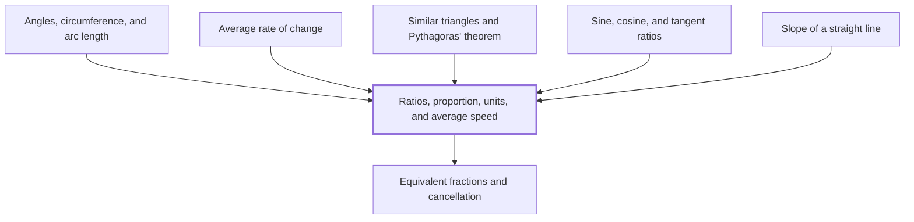

## In one sentence

## Why you need this

## The idea

## Worked example

## Common mistakes

## Builds on

<!-- generated:start builds-on -->
- [[Equivalent fractions and cancellation]] — Equivalent fractions are fractions with the same value, such as $\frac{2}{3}$ and $\frac{8}{12}$, and you get from one to another by multiplying or dividing the numerator and the denominator by the same non-zero number, which in the dividing direction is called cancelling.
<!-- generated:end builds-on -->

## Required by

<!-- generated:start required-by -->
- [[Angles, circumference, and arc length]]
- [[Average rate of change]]
- [[Similar triangles and Pythagoras' theorem]]
- [[Sine, cosine, and tangent ratios]]
- [[Slope of a straight line]]
<!-- generated:end required-by -->

<!-- generated:start mini-map -->

<!-- generated:end mini-map -->

## References
