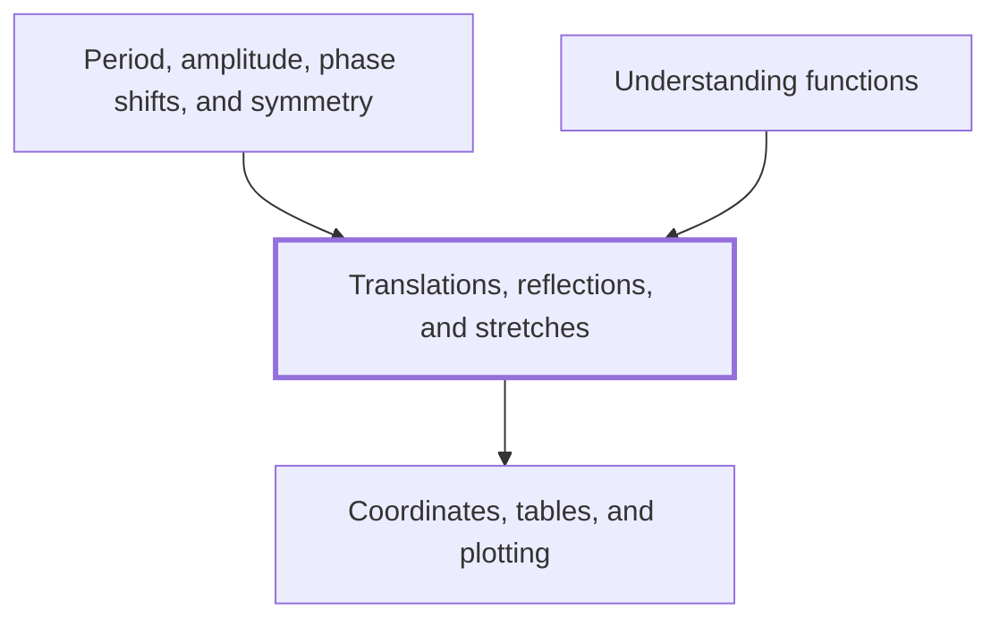

## In one sentence

## Why you need this

## The idea

## Worked example

## Common mistakes

## Builds on

<!-- generated:start builds-on -->
- [[Coordinates, tables, and plotting]] — Coordinates name each point on a grid by an ordered pair $(x, y)$, measured from the origin along a horizontal $x$-axis and a vertical $y$-axis, and a table of values for a rule turns into a graph when you plot each pair as a point and join the points.
<!-- generated:end builds-on -->

## Required by

<!-- generated:start required-by -->
- [[Period, amplitude, phase shifts, and symmetry]]
- [[Understanding functions]]
<!-- generated:end required-by -->

<!-- generated:start mini-map -->

<!-- generated:end mini-map -->

## References
