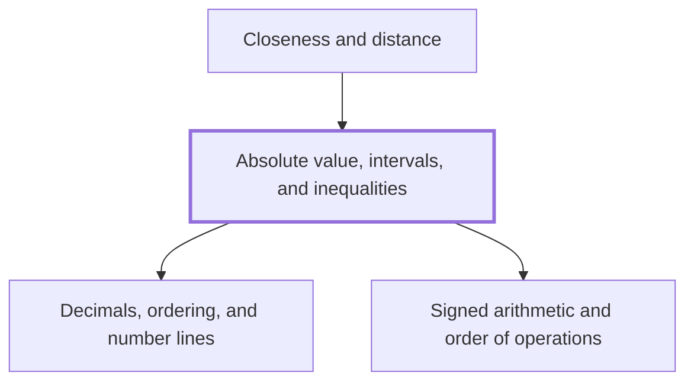

## In one sentence

## Why you need this

## The idea

## Worked example

## Common mistakes

## Builds on

<!-- generated:start builds-on -->
- [[Decimals, ordering, and number lines]] — A decimal writes a number by place value, so that you can compare two decimals digit by digit and place each one at its own point on a number line, where the number further right is always the larger.
- [[Signed arithmetic and order of operations]] — Signed arithmetic is the set of rules for adding, subtracting, multiplying and dividing positive and negative numbers, and the order of operations, BIDMAS, fixes which part of a calculation you work out first.
<!-- generated:end builds-on -->

## Required by

<!-- generated:start required-by -->
- [[Closeness and distance]]
<!-- generated:end required-by -->

<!-- generated:start mini-map -->

<!-- generated:end mini-map -->

## References
