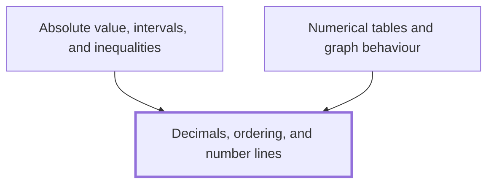

## In one sentence

A decimal writes a number by place value, so that you can compare two decimals digit by digit and place each one at its own point on a number line, where the number further right is always the larger.

## Why you need this

Calculus keeps asking how close one number is to another, and on which side. To answer, you read a decimal such as $1.999$ at a glance, put decimals in order, and picture them as points on a line.

[[Absolute value, intervals, and inequalities]] measures the distance between two points on the number line and describes a stretch of the line between two numbers, so it needs the line and the ordering you meet here. [[Numerical tables and graph behaviour]] reads columns of decimals, such as $2.9$, $2.99$, $2.999$, and asks what they are heading towards, so it needs you to compare decimals quickly and see which way they move.

## The idea

**Place value.** Each place in a decimal is worth ten times the place to its right. The digits after the decimal point count tenths, then hundredths, then thousandths:

$$3.47 = 3 + \frac{4}{10} + \frac{7}{100}$$

This Wiki writes a decimal point, $2.5$, and groups the digits of a long number in threes with a thin space, $12\,345.678$. You may meet other ways of writing these. Much of continental Europe and South America writes a decimal comma, $2{,}5$, for the same number. UK and US everyday print puts a comma between groups of digits, $12{,}345$, which a European reader takes for a decimal comma; that clash is why this Wiki uses a space.

**Zeros at the end.** A zero added after the last digit following the decimal point changes nothing: $0.5 = 0.50 = 0.500$, because each is five tenths. This lets you give two decimals the same number of digits before you compare them.

**The number line.** Draw a straight line, mark a point for $0$, and mark $1, 2, 3, \ldots$ at equal steps to the right. The negative numbers $-1, -2, -3, \ldots$ sit at the same steps to the left. Every decimal has exactly one point: $2.5$ is halfway from $2$ to $3$, and $-0.5$ is halfway from $0$ to $-1$.

**Order.** Of two numbers, the one further right on the line is the larger. You write $a < b$, "$a$ is less than $b$", when $a$ is to the left of $b$, and $b > a$ for the same fact. The symbol $\leq$ means "less than or equal to", and $\geq$ means "greater than or equal to". The narrow end of $<$ and $>$ always points at the smaller number.

**Comparing two decimals.** For two positive decimals, compare the whole-number parts first. If they match, compare the tenths digits, then the hundredths, and so on: the first place where the digits differ decides. For negative numbers the order flips, because moving left takes you further from $0$: $-3 < -2$, since $-3$ is to the left of $-2$.

**Between any two different decimals there is another.** Halfway between $1.9$ and $2$ sits $1.95$, and halfway between $1.99$ and $2$ sits $1.995$. You can keep going for ever, so decimals can get as close to a number as you like without reaching it. On a number line, $1.9$, $1.99$ and $1.999$ crowd closer and closer to $2$ from its left. As an aside you can skip for now, you meet this approach from one side again in [[Left-hand and right-hand limits]].

## Worked example

Put these in order from smallest to largest: $0.7$, $0.65$, $-0.8$, $0.072$, $-0.35$.

**Step 1: split by sign.** The negative numbers, $-0.8$ and $-0.35$, are left of $0$, so they come before every positive number.

**Step 2: order the negatives.** Pad to the same number of digits: $-0.80$ and $-0.35$. Ignoring the signs, $0.80$ is further from $0$ than $0.35$, so $-0.80$ is further left. So $-0.8 < -0.35$.

**Step 3: order the positives.** Pad each to three decimal places:

$$0.700, \quad 0.650, \quad 0.072$$

All have whole-number part $0$. Compare tenths: $7$, $6$ and $0$. The smallest tenths digit is $0$, so $0.072$ is smallest. Then $0.650$ with $6$ tenths, then $0.700$ with $7$ tenths. So $0.072 < 0.65 < 0.7$.

**Step 4: join the lists.**

$$-0.8 < -0.35 < 0.072 < 0.65 < 0.7$$

**Step 5: check on a number line.** Mark $-1$, $0$ and $1$. Then $-0.8$ sits near $-1$, $-0.35$ about a third of the way to $-1$, $0.072$ a little right of $0$, and $0.65$ and $0.7$ a bit over halfway to $1$. Read from left to right, the points come in the order of Step 4.

```interactive
archetype: number-line
range: [-1, 1]
tick: 0.5
points: [0.7, 0.65, -0.8, 0.072, -0.35]
draggable: false
caption: Read from left to right, the five points come in the order of Step 4, with -0.8 the smallest and 0.7 the largest.
```

In general, for positive decimals, the first place value where the digits differ decides the order, and for negatives the order reverses.

## Common mistakes

**Thinking the longer decimal is larger: "$0.65 > 0.7$, because $65 > 7$."** The digits after the point are not a whole number. Pad to the same length: $0.65$ against $0.70$. Then $6$ tenths is less than $7$ tenths, so $0.65 < 0.7$.

**Thinking the shorter decimal is larger: "$0.4 > 0.45$, because tenths are bigger than hundredths."** Both have $4$ tenths, so the tenths do not decide. Compare hundredths: $0.40$ has $0$ and $0.45$ has $5$, so $0.4 < 0.45$.

**Ordering negatives as if they were positive: "$-0.8 > -0.35$, because $0.8 > 0.35$."** On the number line $-0.8$ is further left than $-0.35$, so it is the smaller: $-0.8 < -0.35$. A debt of £0.80 leaves you worse off than a debt of £0.35.

**Thinking $1.999$ is equal to $2$ because it is "nearly 2".** Subtract: $2 - 1.999 = 0.001$, which is not $0$. The decimal $1.9995$ sits between them, so $1.999 < 2$.

## Builds on

<!-- generated:start builds-on -->
*Nothing: this is a Floor Node, knowledge the Module assumes.*
<!-- generated:end builds-on -->

## Required by

<!-- generated:start required-by -->
- [[Absolute value, intervals, and inequalities]]
- [[Numerical tables and graph behaviour]]
<!-- generated:end required-by -->

<!-- generated:start mini-map -->

<!-- generated:end mini-map -->

## References
