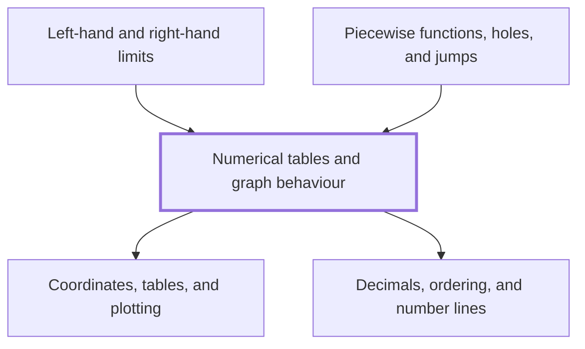

## In one sentence

## Why you need this

## The idea

## Worked example

## Common mistakes

## Builds on

<!-- generated:start builds-on -->
- [[Coordinates, tables, and plotting]]
- [[Decimals, ordering, and number lines]]
<!-- generated:end builds-on -->

## Required by

<!-- generated:start required-by -->
- [[Left-hand and right-hand limits]]
- [[Piecewise functions, holes, and jumps]]
<!-- generated:end required-by -->

<!-- generated:start mini-map -->

<!-- generated:end mini-map -->

## References
