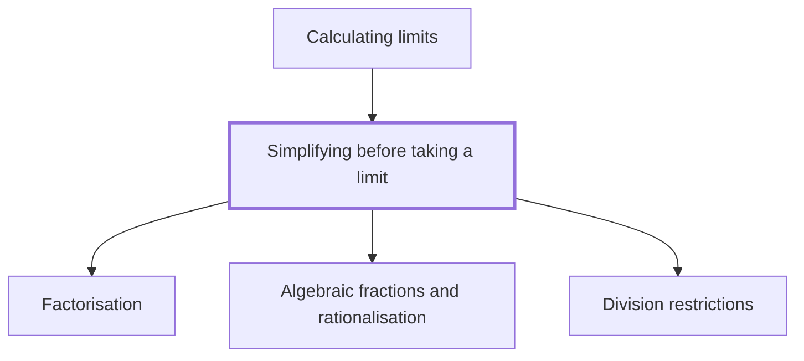

## In one sentence

## Why you need this

## The idea

## Worked example

## Common mistakes

## Builds on

<!-- generated:start builds-on -->
- [[Factorisation]]
- [[Algebraic fractions and rationalisation]]
- [[Division restrictions]] — Division restrictions are the values a letter cannot take because they would make a denominator equal to zero, and dividing by zero has no answer.
<!-- generated:end builds-on -->

## Required by

<!-- generated:start required-by -->
- [[Calculating limits]]
<!-- generated:end required-by -->

<!-- generated:start mini-map -->

<!-- generated:end mini-map -->

## References
