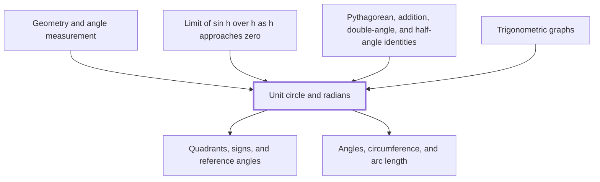

## In one sentence

## Why you need this

## The idea

## Worked example

## Common mistakes

## Builds on

<!-- generated:start builds-on -->
- [[Quadrants, signs, and reference angles]]
- [[Angles, circumference, and arc length]]
<!-- generated:end builds-on -->

## Required by

<!-- generated:start required-by -->
- [[Geometry and angle measurement]]
- [[Limit of sin h over h as h approaches zero]]
- [[Pythagorean, addition, double-angle, and half-angle identities]]
- [[Trigonometric graphs]]
<!-- generated:end required-by -->

<!-- generated:start mini-map -->

<!-- generated:end mini-map -->

## References
